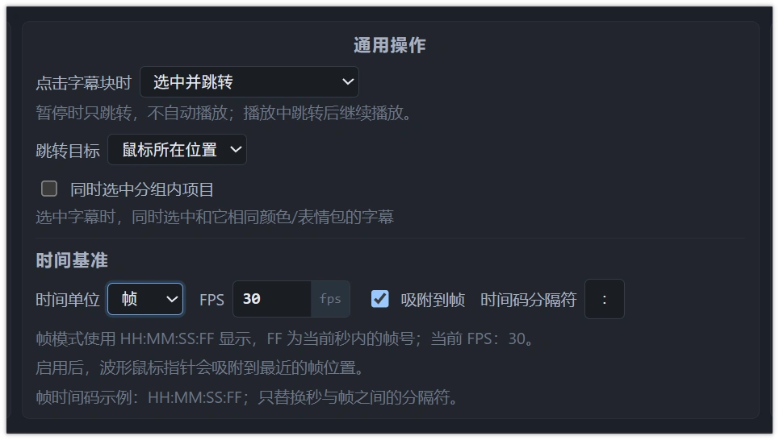
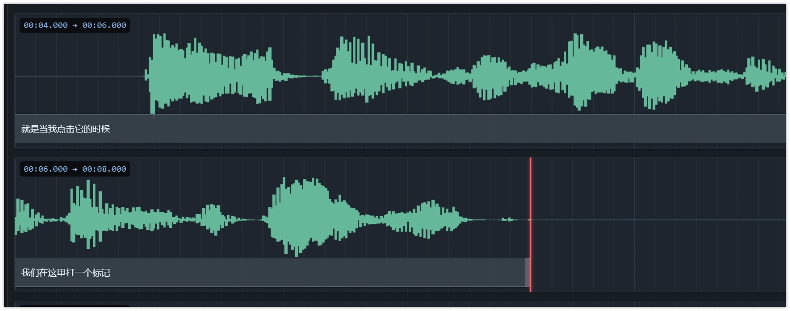
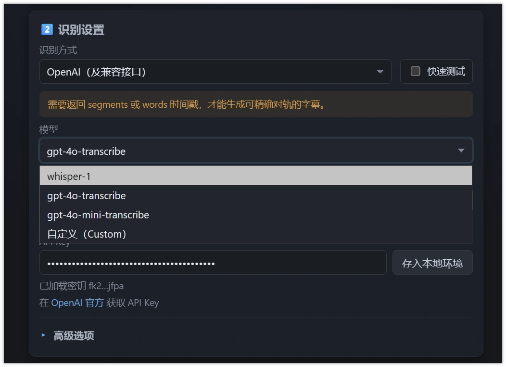
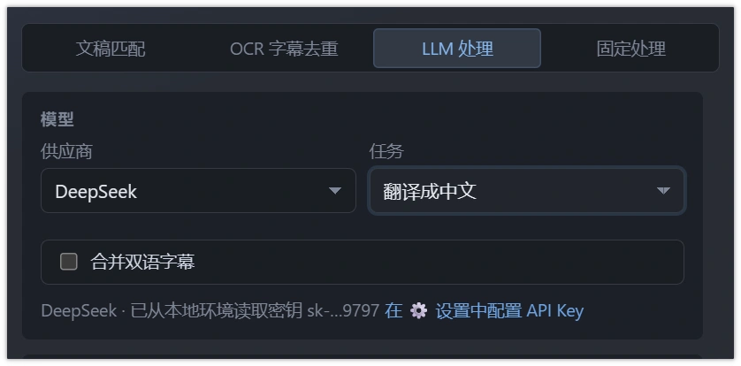
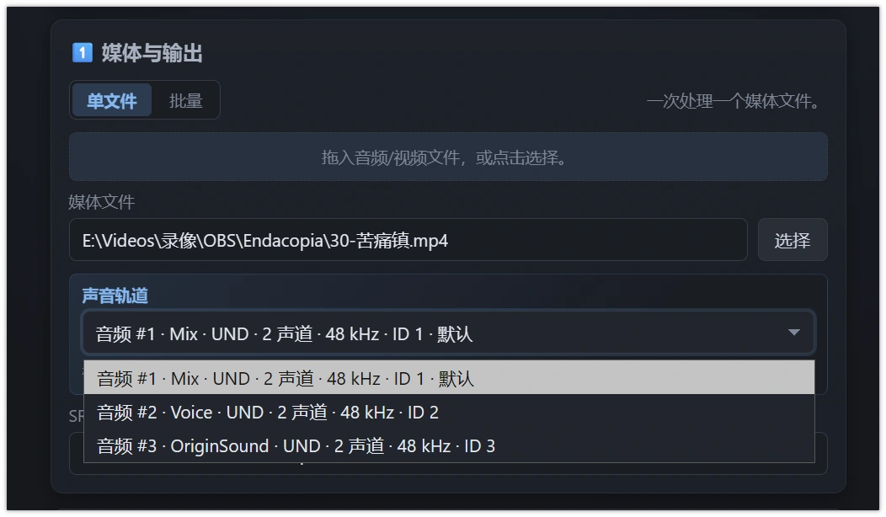

# Changelog

本项目采用 [Keep a Changelog](https://keepachangelog.com/zh-CN/1.0.0/) 的记录方式。

## [Unreleased]

### ✨ 提升

- **编辑器字幕翻译** ： 「字幕 → 批量操作 → 字幕翻译」支持在编辑过程中后台翻译选中或全部主字幕，复用启动器的 LLM 配置；选中已绑定副字幕时自动映射主字幕。结果写入副字幕，保留已有位置、跳过编辑冲突和重叠，支持取消、刷新后检查结果、一次撤销及工程保存版本检查；新增可往返保留的 `msw.editor.v1` 工程扩展。

### ✨ 新增

- **全模块快捷键提示行** ： 「快捷键提示」开关现在同时控制四个模块——媒体播放器（空格/←→/JKL/Home/End）、字幕列表（WASD 选择、Shift+WASD 连选、Ctrl+Shift+A/D 合并前后、Ctrl/Shift+点击、Ctrl+A 全选、Ctrl+D 取消）、波形显示器（操作帮助「波形区操作」全集，16 项横向滚动）。新行与字幕编辑器提示行同一视觉（贴标签栏、底部分隔线、无上圆角）。
- **引导完成态收尾** ： 快速上手完成后右上角按钮由「跳过」变为「介绍引导」（点击重新完整走一遍），不再显示「结束引导」次按钮。
- **命名与色彩统一** ： 「媒体 → 波形设置」更名「波形显示器设置」（含详情窗标题/关闭提示/i18n）；波形显示器设置窗内「振幅 / 显示窗口」步进数值从旧琥珀色改回正常文字色；提示卡内的工程路径文字与内容预览框去除琥珀装饰、并入中性信息样式（警示/选中类琥珀语义保持不变）。
- **快捷键提示行贴顶** ： 开启「快捷键提示」后提示行紧贴上方模块标签栏（消除 10px 间距），背景条上圆角移除，下缘分隔线保留。
- **右键面板细节统一** ： 面板弹出时鼠标精确落在第一个选项的中心（而非面板左上角，含面板内边距补偿与贴边防溢出）；可打开详情窗口的选项挂菜单栏同款「窗口」图标（menu-window-icon），可展开选项使用菜单栏同款「›」展开符，图标体系与菜单栏完全一致。
- **快速上手引导去游离色** ： 引导卡片从琥珀染色（混色背景/3px 琥珀顶边/琥珀光晕/实心琥珀按钮/固定色 #1b1710）对齐到系统弹窗体系——弹窗色键背景 + 常规边框 + 常规投影；按钮/进度/状态/按键高亮/图标块/聚光框全部改用强调色体系；跳过按钮并入标准按钮体系。拆分演示的光标保留琥珀（与全站拆分/选中语义一致）。
- **模块右键面板 v2** ： 媒体播放器画面与字幕编辑器文本区等模块内容区右键同样弹出面板（时间输入等小型控件保留原生菜单）；面板背景/文字/悬停与菜单栏同一套色彩体系（选项卡色键），去掉设置项的齿轮图标；仅含设置项的面板不再出现分隔线；字幕编辑器的设置组改为**悬浮展开的飞出子菜单**（与菜单栏子菜单同样的交互样式，移出自动收起）；工程名悬浮解释更新为「点击打开工程所在文件夹」（两处动态赋值与 i18n 同步）。
- **模块右键面板体系** ： 每个模块的右键悬浮面板统一升级——
  - 面板鼠标移出范围自动收起（280ms 缓冲，与菜单栏一致）；
  - 面板只显示当前可用的操作：波形空白处不再出现「按音频位置拆分」等无效灰显项，位置被占用时「创建字幕」直接缺席；
  - 各模块面板末尾新增设置入口：波形显示器/字幕列表/媒体播放器 → 打开对应设置详情窗；字幕编辑器 → 可展开的开关组（跳转按钮/时间操作/表情包/Esc 取消编辑，与菜单栏同源）；
  - 模块顶栏（标签栏/工具栏）右键同样弹出该模块面板（媒体画面与输入框内保留原生菜单）。
- **模块更名** ： 「当前字幕」→「字幕编辑器」、「视频」→「媒体播放器」、「波形」→「波形显示器」（标签栏/窗口菜单/帮助与 i18n 同步）；「字幕 → 字幕编辑设置」更名「字幕编辑器设置」。
- **灵梦主题钦定色** ： 播放头 #ff0015、字幕块 #bbaaaa，其余键不变。
- **启动器自动刷新服务器状态** ： 回到启动器窗口（focus/可见性变化，1.5s 节流）即自动探测服务器状态——从编辑器切回或「退出编辑器」后不再需要手动点刷新。
- **拖动字幕块提示降噪** ： 拖动/共享边界调整过程不再逐帧弹出气泡——实时增量（移动中 · N 条 · +NNN ms）改挂到波形区右上常显数据行，松手后数据行自动还原为「时长 · 峰值数」，仅保留一条结果总结（如「已联动移动 1 条字幕」）。
- **双列表头短前缀修正** ： 压缩态保留单字前缀「主 1 / 副 1」（此前整个前缀被隐藏只剩序号，悬浮 title 仍是全称）；压缩生效（<460px）后双列字数延后到 420px 才隐藏——时间压缩省出的空间优先还给字数。
- **字幕列表窄宽度策略 v2（压缩优先于隐藏）** ： 收窄时先压缩——时间省去毫秒小数（00:00.000 → 00:00，CSS 伪元素切换零 DOM 开销）、双列表头「主字幕 1/副字幕 1」缩为「主 1/副 1」（悬浮 title 保留全称）；进一步收窄才依次隐藏 字数（单列 <300px / 双列 <500px）→ 时间（<200px）→ 序号（<120px）。默认布局完整显示毫秒与字数（此前字数在 360px 就过早消失）。
- **静音图标修正** ： 重绘音量图标的静音叉形，垂直居中对称，不再倾斜。
- **页面全屏** ： 「窗口」菜单末尾新增「页面全屏」——整页进入浏览器全屏（Esc 退出），菜单文案随状态切换为「退出页面全屏」，附英文词条。
- **点击工程名打开所在文件夹** ： 服务器版点击右上角未展开的工程名，改为在系统文件管理器中打开工程所在目录（新增本机端点，仅限已绑定工程）；file:// 便携版回退为复制工程名，详情卡内的完整路径仍可复制。
- **音量图标重绘** ： 媒体控制条音量图标由 emoji 换为白色矢量喇叭（跟随控制条配色），音量为 0 时切换为静音叉形。

### 🐛 修复

- **字幕列表窄宽度挤压** ： 列表模块过窄时按 容器宽度 分级退让——先隐藏字数（双列模式更早）、再隐藏时间、最后隐藏序号，文字区任何宽度可用，不再挤压换行。
- **选中行字数颜色** ： 播放中行的字数与序号/时间统一使用「播放头」色（此前为强调色）。
- **双列字幕列表显示字数** ： 双字幕（主/副双列）模式下，字幕列表设置中的「字数」开关现在同样生效——主/副列头右侧各自显示字数（按各自轨道的切句类型统计，超阈值加粗），此前该开关在双列模式下无任何效果。
- **品牌收尾** ： 启动器首页标识、访问链接与全部文档/入口描述统一为 Moyor's Subtitle Workflow（MSW/MSWE），启动器「访问官网」指向本仓库。

### 🐛 修复

- **拖动 视频/当前字幕 分隔线拉不动面板** ： 面板行轨道此前被内容高度钉死（max-content 下限），拖动分隔线只平移面板、空间全给底部列表；现改为按百分比伸缩的轨道——拖动只移动这条边界（下方分隔线不动），增减空间由「当前字幕」吸收，面板内容不足时优雅收缩。选中字幕不再改变行高的特性保持。
- **时间基准设置布局错乱** ： 上游的横向 flex 结构在设置窗里错位成锯齿；改为独立「时间基准」小节（通用分类下），四行与设置窗其他行完全同构。
- **媒体预览字幕被进度条遮挡** ： B 站式控制条淡入时字幕带同步上移一个控制条高度（同触发条件、同过渡时长），暂停时常显的控制条不再压住底部字幕（含副字幕行）；几何编辑状态豁免，拖拽落点不漂移。
- **外观偏好跟服务器走** ： 主题预设、自定义颜色与自定义主题列表不再只存在浏览器 localStorage（按「协议+域名+端口」隔离，换端口/换浏览器即"消失"），服务器版会同步到本机落盘（`C:\Users\<用户>\AppData\Local\MAW\server-editor-settings.json` 的 appearance 字段）：页面启动时拉取服务器副本并覆盖本地（服务器为准），服务器还没有副本时把当前本地状态播种上去；之后切预设、改颜色、增删自定义主题、暂存清理均去抖写穿（400ms 合并，失败静默）。多端口/多实例并存时读取端重读磁盘，长驻实例不再滞留旧外观。file:// 离线模式自动休眠，行为不变。

### 🐛 修复

- **当前字幕统计数值归弱文字** ： 「总长度 / 字/秒」的数值从主文字色改为与标签一致的弱文字色（保留等宽数字排版），不再从页脚信息行中跳出。
- **空态占位与工具窗底的漏网固定灰蓝** ： 「字幕列表为空」的占位层（--empty-raised 渐变，原固定 #22262e——空白工程下看到的列表"背景不跟随"即是它）与工具窗/弹窗窗体渐变底的 CSS 默认值（--gap-panel-bg，原固定灰蓝）改为由「内容区/弹窗」键派生，任何主题下空列表、播放器空态与工具窗底都跟随主题；实测小铃主题下整页无灰蓝残留。
- **小铃/莲子预设弹窗色补齐** ： 「小铃」新增「弹窗」默认色 #371c15、「莲子」新增「弹窗」默认色 #080707（此前两套深色预设未定义弹窗键，弹窗走的是通用派生色）。
- **全部结构色跟随主题（不再有固定灰蓝）** ： 背景阶梯（面板/内容区/浮层/输入框/波形背板与行）、边框三级、按钮家族、滚动条、模块标签栏与波形工具栏默认值全部改为由「背景 × 文字」色键按固定比例 color-mix 派生——切换任何预设或自定义任何键后边框、分隔线、内容区、按钮、滚动条、波形区随之变色；波形字幕块默认值改由强调键派生，当前字幕块底、指针线、禁用态斑马纹、空隙手柄（原固定蓝）、空隙标签/范围预览徽章（原固定灰蓝）同样全部键化派生。默认主题（默认）视觉几乎不变（派生值按原值校准），语义色（红/琥珀/绿）与各键默认值保持不变。字幕列表背景（含其行底）即随「内容区」键联动。
- **恢复默认布局后点标签布局跳动** ： 预设布局下点击模块标签弹出「变成其他模块」菜单时，不再提前把工作区从预设转换为自定义树（此前打开菜单的瞬间整个工作区重排一下）；真正选择替换目标时才转换。
- **预设主题恢复独立「默认/紫苑」** ： 「紫苑（默认）」改回「默认」（MAW 标准深色）；新增独立预设「紫苑」，配色为用户自定义主题「新的紫苑配色」的 15 键值固化（背景 #1a1b26、文字 #c0caf5、强调 #80d0ff、波形 #6f60e2、播放头 #f8727c 等），删除该自定义主题不影响预设；预设顺序调整为「默认、紫苑、小铃、莲子、灵梦、爱丽丝、恋」。
- **粘贴字幕不可见** ： 粘贴的副本现在整体平移到时间轴末尾（保留相对间隔），不再与源字幕在波形中完全重叠。
- **窗口菜单子菜单展开** ： 移除旧工具栏遗留的 ID 级下拉定位规则，「界面配置」等子菜单统一向右展开。
- **波形数据行与操作消息分离** ： 右上新增常显数据行（媒体总时长 · 波形峰值点数，悬浮有解释），工具切换/窗口停靠等瞬态消息不再覆盖它。
- **窗口切换浮窗** ： 模块图标的点击菜单改为可拖动浮窗（标题 + 右上角关闭按钮），与拼接/延长字幕等工具浮窗风格一致。
- **设置弹窗行布局** ： 修复媒体播放器设置/波形设置弹窗内设置行被通用弹窗 `label` 样式压成块状布局的问题（取色行标签与色块重叠、内容溢出弹窗右缘的根因）；各行恢复「标签左/控件右」排版，两个弹窗在窄窗口下也不再横向溢出。
- **波形设置遮罩下的边框穿出** ： 媒体播放器设置/波形设置改为与「延长字幕」同款的可拖拽非模态工具窗（标题栏拖动、右上角关闭、Esc 关闭、位置记忆），不再使用全屏遮罩——原先嵌在波形分区内导致的布局分隔条穿出遮罩高亮问题随之消失。
- **项目详情卡** ： 移除右上角关闭按钮，鼠标移出即自动收起。
- **字幕设置子菜单风格统一** ： 「字幕编辑设置 / 字幕列表设置」子菜单去掉嵌套卡片框，分组标题与行密度向「多重字幕设置」等其他子菜单看齐。
- **模块手柄（Blender 式图标块）** ： 各窗口左上角手柄改为「图标 + 下拉箭头」一体按钮，图标垂直居中于模块工具栏；字幕编辑区改用 T 形文字图标与字幕列表区分。
- **模块窗口菜单（Blender 式）** ： 手柄点击菜单改为纯图标竖排（其他窗口类型 + 底部垃圾桶关闭），无文字与关闭按钮；鼠标移出菜单/手柄后自动收起；悬浮手柄不再展开名称。
- **全局设置横向溢出** ： 设置窗口内旧工具栏时代的横向分组布局在窄内容列里溢出（需向右滚动才能看全）——内容组改为单列纵排后六个分类全部完整显示，无需横向滚动。
- **菜单栏移出自动收起** ： 点击选项卡展开菜单后，鼠标移出菜单栏范围（含展开的子菜单）即自动关闭。
- **字幕列表工具栏** ： 计数与「过滤字幕 / 批量操作 / 仅看超长」稳定同排显示，窄宽度下不再被挤没。
- **空隙设置归类** ： 「媒体 → 音频设置」中的「静音空隙」分组更名「空隙」，按「静音空隙工具 → 非字幕片段设为空隙 → 播放时跳过空隙」排序；「非字幕片段设为空隙」从勾选框改为一次性按钮（把音频中未被字幕覆盖的片段全部设为空隙，可撤销），配合跳过播放只播有字幕区域。
- **波形数据行** ： 只在加载媒体后显示「媒体总时长 · 波形峰值点数」；仅有缓存波形时不再显示占位文本。
- **快捷键提示开关** ： 子工作区顶部栏的 Enter/Esc 等键位提示默认隐藏，「帮助 → 快捷键提示」勾选后显示并记忆偏好。
- **预览开关收纳** ： 「预览字幕 / 预览副字幕 / 预览表情包」从播放器工具栏收进「媒体 → 媒体播放器设置 → 播放预览」。
- **全局设置固定尺寸与多级导航** ： 设置窗口高度固定，切换分类不再改变大小；导航新增置顶「全部」（所有分类连续展示并显示分类标题）；含多个子分区的分类带「›」箭头，仅在该分类激活时展开二级导航（箭头随展开旋转朝下），点击直达对应分区。
- **外观主题系统（VSCode 式）** ： 移除独立的主题与强调色预设，改为完整主题预设（深色/浅色/午夜/苔原/暖砂，决定明暗、强调色与基础配色）+ 五项自定义颜色（背景/文字/波形/字幕/强调），任一颜色可单独覆盖当前主题，一键恢复主题默认；主题与自定义颜色随「界面配置」导出导入，旧偏好自动迁移。
- **全局设置改为可拖拽工具窗** ： 与媒体/波形设置等工具窗交互统一——标题栏（含搜索框）可拖动、右上角关闭、Esc 关闭、位置记忆。
- **每个模块都有顶部栏** ： 播放器模块恢复顶部栏，四个子工作区的手柄统一嵌在各自顶部栏最左侧并垂直居中（字幕列表的 sticky 手柄通过工具栏负边距叠回同一行）。
- **波形顶栏右侧只放数据行** ： 瞬态操作消息（停靠/工具切换等）改为浮动提示，不再与「时长 · 峰值数」挤在同一行。
- **快捷键提示的隐藏修复** ： 键位提示的容器样式会压过 hidden 属性导致开关看似无效，已显式声明 `[hidden]` 优先。
- **详情卡媒体名同款高亮** ： 悬浮与点击复制行为与工程名一致（虚线下划线 + 强调色高亮，点击复制媒体文件名）。
- **模块顶部栏深色统一** ： 四个子工作区的顶部栏统一为波形栏的深色背景。
- **字幕列表控件收纳** ： 「过滤字幕 / 按颜色过滤 / 批量操作 / 仅看超长 / 显示计数」从字幕列表顶部栏迁入「字幕 → 字幕列表设置 → 过滤与操作」，顶部栏只承载模块手柄。
- **波形显示模式归位** ： 多行/基础波形从「媒体」菜单移入「波形设置」窗口（音频波形区顶部的切换行）。
- **空隙设置归类** ： 「媒体 → 音频设置」更名「空隙设置」（静音空隙工具 / 非字幕片段设为空隙 / 播放时跳过空隙，不再分小组）；「空隙区段操作方式」从波形设置窗口移入静音空隙工具窗的「空隙操作」区。
- **波形显示改为下拉** ： 「波形设置」窗口的显示模式从双按钮切换改为下拉选择，为后续更多显示模式预留。
- **薄顶栏（UE 式）** ： 模块顶部栏减薄到 28px、与 24px 的模块手柄匹配（手柄几乎填满顶栏），选择/分割等工具按钮同步紧凑；当前字幕模块去掉顶栏下方的第二条背景带，顶栏直接衔接内容区。
- **字幕列表滚动条修正** ： 字幕列表改为「顶栏 + 滚动区」两层结构，滚动条从顶栏下方开始，与音频模块一致。
- **模块手柄开合** ： 再次点击手柄会收起窗口菜单（此前会闪烁重开）。
- **模块窗口化（Windows 式标题栏）** ： 每个模块的顶部栏改为窗口标题——左侧「图标 + 名称」（与标题栏背景融合、无箭头，拖拽仍可停靠/交换，点击展开切换菜单），右侧「×」直接关闭该窗口（菜单中的垃圾桶随之移除）；「快捷键提示」开启后显示在标题栏内、标题右侧的单行小字，不再占第二行。
- **模块标签化（Windows 文件夹式标签组）** ： 模块顶部改为标签栏——标签 =「图标 + 名称 + ×」（× 紧跟名称，点击关闭该窗口），行尾「+」把其他模块并入同一区域成为并排标签；把标签拖到另一区域中心（或其标签栏上）即并入该标签组，四边半区仍为分屏、根边缘为整窗停靠；点击标签切换显示，激活标签与内容融合、未激活更暗；标签组随工作区保存/导出。同时移除上一版的浮动窗口方案与当前字幕模块左侧的黄色标识条，播放器/字幕列表的空工具栏不再占位。
- **窗口重复出现与标签增强** ： 允许同一模块重复出现——点单标签弹出「与标签同宽」的模块下拉（图标+名称），选择后本窗口原位变成该模块（原模块不挪位）；「+」直接复制当前窗口为新标签，真实窗口随新标签显示，其余重复位置显示占位卡片（点其标签可把窗口切换过去）；标签组内成员支持同模块多份。拖动标签到其他模块的标签栏附近即并入该组并排。
- **当前字幕模块统一与底栏重排** ： 模块外框平铺（去边框圆角，标签栏通到模块两端）与其他窗口一致；「未选择」移至左下角，「总长度 / 字/秒」移至右下角。
- **标签交互修复** ： 面板全局按钮样式不再给「+」按钮上底色；窄面板放不下键位提示时隐藏提示行（不再出现空白条）；拖拽标签松开在页面外不再触发浏览器的打开/撕出标签页行为。
- **模块唯一实例语义** ： 标签下拉选择 = 与所选模块互换位置（替换，不再产生重复实例与占位卡片）；「+」列出尚未出现的模块供并入本组，全部已显示时点击无效果；一个模块只在一处出现，各标签组切换互不影响（连锁切换与空白占位条随重复实例机制一并移除）；「快捷键提示」开启时在标签栏下方独立一行显示（不再受面板宽度隐藏）。
- **模块间距收紧** ： 自定义/标签布局清除了预设流式布局遗留的模块外边距，分屏分隔条改为 4px 且默认隐形（悬浮/拖动时才显示强调色抓取线），模块之间不再出现空白缝；含重复模块的旧布局数据在加载时自动回退为默认布局。
- **标签组渲染与分栏拖动三项关键修复** ： 1) 模块元素自带的 display 样式压过 hidden 属性，导致标签组内未激活成员从未真正隐藏（即“分裂成两个模块、两条标签栏联动切换”的根因），现显式声明 hidden 生效；2) 点击单标签弹出“变成模块”下拉时不再提前把预设布局转换为自定义（此前转换重排就是空隙来源），选择替换动作时才转换；3) 补回被误删的预设分栏拖动方法，wave-right 预设的行/列边界线恢复可拖拽。
- **恢复默认布局与面板空白修复** ： 「恢复默认布局/切预设」现在会清空标签/关闭留下的隐藏记录并恢复全部四个模块（此前并排/关闭过的状态会让预设只剩两个模块）；删除当前字幕面板在自定义布局下遗留的 30px 顶部让位内边距（旧绝对定位手柄时代产物），标签栏与内容纵向填满模块、与其他模块和分界线无缝衔接。
- **模块视觉统一** ： 四个模块内容区完全统一为同一浅色底 #22262e（含字幕编辑文本框、时间输入、波形画布行背板、空态遮罩与视频区），标签栏与未激活标签为深色、激活标签与内容同色无缝衔接；「+」下拉改为在按钮正下方展开；移除波形工具栏冗余的「波形」文字标签。
- **空隙工具语义与菜单** ： 「非字幕片段设为空隙」不再依赖音量扫描——把全部音频时长中未被启用字幕覆盖的区段直接标记为空隙（与静音检测无关）；「媒体 → 空隙设置」新增「清除全部空隙」（删除全部空隙记录，可撤销）。
- **媒体步进按钮** ： 前进/后退改为顺/逆时针旋转图标并在按钮内显示秒数（如 1s），时长随「媒体播放器设置 → 每次跳转时长」实时变化。
- **主题预设（东方角色系列）** ： 主题预设改为「默认 / 紫苑 / 灵梦 / 爱丽丝（浅色）/ 恋 / 八云紫 / 莲子（黑色系）」七套角色风格配色，新增红/金/银三组强调色；旧预设与自定义颜色自动迁移到最接近的新预设。
- **自定义颜色扩展** ： 新增「外面板色」（模块顶栏等深色面板）与「内面板色」（模块内容浅色面板）两个取色项；取色器改为方形色块一行并排。- **色彩体系专业化（第二轮）** ： 色键 12→13：「面板」更名「菜单栏」、「浮层」更名「选项卡」，新增「空隙」（波形空隙条纹色）；「输入框」「边框」改走独立表单令牌——不再影响波形工具栏控件，且覆盖当前字幕的文本框/时间输入/搜索框等全部表单描边；颜色面板改三列网格消除右侧空白。- **色彩体系专业化（第三轮）** ： 删除「边框」色键（一般无需修改）；「输入框」色键升级为全局表单底色——覆盖当前字幕文本框/时间输入、字幕列表搜索、各设置窗的输入/下拉/选框（实测一键改色 7 类控件全部跟随）；颜色面板改为一行五列并行排列（12 键 = 2 行 + 2 键），消除右侧空白。- **主题与交互第四轮** ： 浅色主题的输入框底色跟随主题（不再残留暗色）；切换预设时当前自定义颜色按预设暂存、切回自动恢复（恢复默认按钮同时清暂存）；外观新增「自定义」主题行——加号以当前外观快照命名新建主题（存本机、可切换、可叉删）；模块标签下拉支持再次点击收起、移出标签+下拉组合范围自动关闭、标签组内已激活标签也可弹出「变成模块」下拉。- **主题与交互第五轮** ： 修复预设布局下标签下拉定位到左上角、鼠标滑入下拉被误关（改为标签+下拉组合范围的指针追踪判定）；紫苑预设固化顶栏/抬升面配色；「字幕色」扩展为同时覆盖字幕列表、编辑区与波形块文字（媒体预览除外）；新增「字幕块」色键（波形中字幕矩形块体色，选中字幕仍显示其语义色）；颜色面板改为自适应并排（约一行七键），不留右侧空白。- **主题与交互第六轮** ： 颜色面板恢复并排（竖列是外层表单网格压缩所致，现标题独占一行、色键网格全宽约六键一行）；主题区改为「预设主题 / 自定义主题」两个平行分组（同样式按钮与文字，自定义条目右侧悬浮叉号、加号纯图标无方块）；首次启动自动把自定义主题「自定义1」吸收为紫苑预设；波形/字幕/字幕块/空隙色拖动取色器时即时重绘；系统取色器弹窗（RGB/HSL 切换按钮黑框）通过 color-scheme 跟随主题修复；自定义主题的「恢复主题默认颜色」恢复到该主题建立时的快照。- **主题与交互第七轮** ： 「＋」移到「自定义主题」标题文字后；自定义主题与预设一样横排；条目叉号改为与模块标签一致的透明底小叉（悬浮红）；「字幕块」颜色真正生效（无语义色字幕的兜底色改读自定义令牌，实测改 #e05555 块体即时跟随）；波形工具（选择/分割）改 Pr 式——默认纯图标+透明底，选中为强调色实心方块（白图标）。- **菜单与字幕工具第八轮** ： 「字幕列表设置」从悬浮子菜单改为点击打开的可拖拽详情弹窗（内容不变：过滤/批量/显示等全部迁入）；「延长字幕」改为「缩放字幕」悬浮子菜单——缩放字幕（%）、起点/终点/整体偏移（可为负=向左）四行输入即生效（可撤销，未选中时对全部生效），移除执行按钮；选项卡悬浮 120ms 直接展开、离开菜单栏自动关闭、横向滑动切换保留；自定义主题按钮加宽不与叉号重叠、「恢复主题默认颜色」增加上间距；新建自定义主题改为读取各取色器当前实际颜色（含 CSS 内联覆盖值）作为快照，不再回退到旧主题。- **菜单与字幕工具第九轮** ： 修复「恢复默认布局后点标签下拉弹到左上角」——预设→自定义转换会重建标签节点，旧引用的矩形归零导致定位到 (8,8)；改为进入时先锚定标签矩形、定位后重解析活动标签节点。「缩放字幕」更名「缩放/偏移字幕」并对齐其他子菜单的分组标题/行距/悬停样式；偏移输入支持 Enter 确定（应用后自动归零，便于连续多次偏移）；「字幕列表设置」弹窗布局重排——去除旧菜单类残留、内容区两栏行风格与全局设置完全一致（实测分区宽度精确填满）。- **菜单与字幕工具第十轮** ： 详情窗内部分区（主/副字幕、拼接/合并等）底色统一为与「全局设置」相同的抬升面色；「当前字幕」副字幕目标与操作帮助重点文本从琥珀橙改为正常文字色；帮助面板「快速上手」移到「进阶」左侧并统一为选项卡样式；「缩放/偏移字幕」改回可拖拽详情弹窗（修复执行报错：渲染改走全量刷新、保存链补齐）；三个选中标记令牌（字幕列表选中行、波形选中框、拖选预览）全部桥接「空隙」自定义颜色；紫苑预设的空隙色固定为 #ffdc00。移出菜单栏自动关闭下拉在水平/斜向移出时均验证通过。- **菜单与字幕工具第十一轮** ： 修复嵌套子菜单互斥（「更多导出→OTIO」悬浮即被关闭）——打开嵌套子项时保留祖先链只关平级、清祖先关闭计时器；字幕列表选中行从琥珀改接 selection 令牌族（随「空隙」自定义色）；主字幕的缩放/偏移现在同步带动绑定的副字幕（复用延长字幕的绑定同步路径，随撤销一起还原）。

- **关闭按钮强调色统一** ： 全部工具窗（延长字幕/拼接/媒体/波形/全局设置等）关闭按钮同尺寸风格，悬浮高亮从琥珀橙全面改为强调色（暗浅两套令牌同步）；悬浮色 = 强调色混合。
- **子菜单布局抖动修复** ： 高子菜单（字幕列表设置等）展开不再把页面撑出滚动条——超出视口时向上翻起并按可用高度内部滚动，页面布局纹丝不动。

- **设置搜索修复** ： 无子分区的分类（外观）此前不参与搜索（搜「自定义颜色」无结果），现与普通分类一致可搜。
- **切换主副按钮对齐** ： 文字改为与其他菜单项一致的左对齐。
- **版本徽标** ： 详情卡版本显示为「MAWE v1.5.3」。
- **菜单与字幕工具第十二轮** ： 「导出完整字幕」更名并归类——文件菜单的导出分类现为「导出工程 / 导出字幕 / 去空隙版本 / 更多导出」；「导出字幕」子菜单提供主字幕（SRT/ASS）与副字幕（SRT/ASS），无副字幕轨时副字幕项自动隐藏，双语合并工程下主字幕项显示「双语字幕」；「字幕」菜单移除原「仅导出主/副字幕」两项。
- **菜单与字幕工具第十三轮** ： 「批量操作」上移到「字幕 → 处理」子菜单（批量替换 / 纯文本编辑 / 文本处理，均打开详情窗口）；「字幕列表设置」重排——首个分区改为「字幕过滤」：内容过滤（输入框）、字数过滤（>= / <= 比较符 + 数值，输入即生效并兼作字数标记阈值，替代原「仅看超长」按钮与「字数阈值」行）、颜色过滤（与波形右键「标记颜色」同款的五色圈，点击切换，可多选，附「全选过滤结果」）；修复紫苑预设吸收的「自定义1」配色随页面刷新丢失的问题（吸收结果现在落盘持久化，空隙色保底 #ffdc00）。
- **缩放/偏移字幕交互微调** ： 缩放应用后输入框自动回到 100（与偏移行“应用后归零”一致）；输入框内拖选数值不再触发浏览器“拖放文本搜索”（拖出输入框松开会新开搜索页的问题）；全站文本选中高亮从 16% 透明强调色改为强调色实心 + 白字，拖选状态一目了然。
- **字幕列表设置第四轮** ： 修复颜色过滤色圈被通用按钮样式压成圆角方块（现与波形右键「标记颜色」完全一致的 22px 正圆）；内容过滤清除叉号垂直居中贴输入框右缘；「隐藏禁用字幕」移入「显示」分区更名「禁用字幕」（勾选 = 在列表中显示被禁用的字幕），默认不勾选即隐藏禁用字幕，旧实例一次性迁移到新默认。
- **缩放/偏移字幕重构（防重叠 + 微调）** ： 缩放与偏移应用时走波形拖动同款「邻居约束」——期望范围自动夹到前句终点与后句起点之间（多选按时间序逐条约束），彻底消除字幕重叠，保存时不再弹「时间重叠」修复卡片，受限时提示「N 条受相邻字幕限制」；每行新增 −/＋ 步进按钮（长按连发），滚轮改为多档即时应用（缩放 ±1%，Shift ±5%；偏移 ±10ms，Shift ±100ms、Ctrl ±1ms）。
- **紫苑预设钦定配色** ： 紫苑默认色更新为用户钦定的完整 14 键固有色（背景 #050915 / 菜单栏·顶栏 #0d0d21 / 抬升面 #121b2b / 输入框 #1a1d24 / 选项卡 #282c35 / 强调 #224daa / 波形 #7362f3 / 字幕块 #84809d / 空隙 #ffdc00 等）；「自定义1」吸收机制退役并清理历史落盘值。
- **自定义颜色体系三处升级** ： 「选项卡」色现在同时驱动全部工具窗的渐变底色（此前只有居中弹窗跟随，改了看起来像无效）；「空隙」色键更名「选区」；新增「命中」色键（波形中当前位置指示条与当前字幕块的轮廓，含光晕派生）。
- **字幕列表字数统计** ： 改为弱文字色纯文本，超长仅加粗提示，移除红色底色与边框。
- **缩放/偏移与自定义颜色第五轮** ： 缩放新增「缩放锚点」——默认「各自中心」，可切「整组范围」（按选中整体起止等比缩放，组内间隔同比）；数字输入框移除上下箭头，步进按钮改为无背景透明底的左右箭头（长按连发）。颜色过滤在双列多重字幕模式下可用并支持多选（此前整行禁用导致“选不了”，现仅副轨模式暂停）。字数过滤比较符默认 >= 且常显。「选项卡」色改管菜单栏/模块标签展开的悬浮面板，新增「弹窗」色键（居中弹窗与工具窗）；「命中」更名「播放头」（并延伸到当前行序号/时间）、「抬升面」更名「内容区」、「字幕」更名「字幕文字」、「顶栏」更名「标签栏」，颜色面板按视觉层级重排为 15 键。字幕列表序号/时间垂直对齐并加「|」小分隔，当前（播放中）行改用播放头色。
- **界面细节第六轮** ： 修复字数过滤比较符「>=」被原生下拉箭头挤到看不见的问题（框固定加宽至 58px 常显），字数阈值 16 的旧默认清零改为一次性迁移（不再吞掉用户显式输入的 16）；全部 × 叉号（模块标签、自定义主题、自定义工作区、工具窗/弹窗关闭、过滤清除）统一换成几何居中的 SVG，消除字符 × 视觉偏上的问题，自定义主题叉号补齐悬浮红底；自定义颜色面板固定一行 5 个 × 3 行，色块改为无边框小方块（同预设主题色方块），文字保持单行；紫苑预设默认配色保持用户钦定的 13 键固有色（「弹窗/播放头」等未列出键随主题默认，用户新配色由自定义主题「新的紫苑配色」持有，与预设互换互不覆盖），预览方块对齐预设实际色值；通用文字收拢为「文字 / 弱文字」两级（原 muted/faint 两级过渡色并入弱文字，「时长 · 峰值数」数据行等随之归位），补齐「背景 / 文字 / 弱文字 / 输入框 / 强调」五个色键的英文词条。
- **界面细节第七轮** ： 工具窗/弹窗顶排背景改为跟随自定义颜色「标签栏」键（原为独立固定渐变）；菜单栏下拉在鼠标离开展开标签（含划过菜单栏空白条）后 280ms 自动收起，与模块标签栏行为一致；多行波形第一条到工具栏的空余量从 26px 收敛为与行间距一致的 10px；全部可按控件（按钮、菜单项）统一按压体系——按下时 1px 下压 + 整体压暗（brightness 0.88），替代此前工具栏灰底、工具窗位移、步进按钮变色等各自为政的按压样式（色圈按下保持放大形态）。
- **自定义主题列表兼容修复** ： 读取自定义主题时不再因快照缺少 `theme` 字段而把记录从列表里静默过滤（数据一直在浏览器 localStorage，只是不显示）；缺失字段按深色补默认，旧快照恢复可见、可正常切换。
- **预设主题重组（紫苑归位 + 小铃登场）** ： 「默认」预设更名「紫苑（默认）」（键值与配色不变，仍为 MAW 标准深色）；移除独立的「紫苑」预设（其钦定配色由用户自定义主题持有，仍在使用旧预设的实例一次性迁移到「紫苑（默认）」并清理暂存覆盖）；「八云紫」预设由「小铃」接替——本居小铃黄棕橘暖调深色主题（深棕黑底 #170f08、橘红强调 #c9552b、黄色波形 #e5a83d、暖奶油文字），仍在使用八云紫的实例迁移到小铃；预设顺序调整为「紫苑（默认）、小铃、莲子、灵梦、爱丽丝、恋」；自定义颜色色块加 1px 细描边，与单元格底色接近时也能看清边界。
### ✨ 提升（界面细节第二轮）

- **主题重排与差异化（东方角色）** ： 顺序改为「默认 + 灵梦 / 爱丽丝 / 恋（三套浅色）+ 紫苑 / 八云紫 / 莲子（三套深色）」——灵梦=米白底红强调（红白巫女浅色）、爱丽丝=淡蓝底金强调 + 蓝色波形（金发蓝裙）、恋=暖黄底绿强调（黄上衣绿裙浅色）；紫苑/八云紫/莲子为深色组各自带独立底色与波形色；新增蔚蓝（azure）强调色组，浅色旧数据自动迁移到灵梦。
- **专业色彩自定义** ： 自定义颜色扩展为 12 个色键——背景 / 面板 / 抬升面 / 输入框 / 浮层 / 文字 / 弱文字 / 强调 / 边框 / 波形 / 字幕 / 顶栏，恢复「标签左 + 色块右」的原行样式（两列网格），覆盖界面全部主要颜色层。
- **空隙样式统一** ： 「非字幕片段设为空隙」产生的空隙以音频门控源写入，与静音空隙同样的斑马纹样式，不再带蓝框「受保护」区分。
- **界面语言下拉** ： 语言切换从按钮改为「中文 / English」下拉选择。
- **按钮风格统一** ： 全局设置窗口右上角关闭按钮对齐「延长字幕」工具窗的样式与尺寸；工具窗关闭/帮助按钮的悬浮高亮从琥珀橙改为强调色；工具栏「未保存」脏按钮同样改用强调色。
- **自定义工作区叉删** ： 「窗口 → 工作区布局」的自定义工作区条目右侧带 ×（悬浮红），点击确认后删除，与模块标签的关闭一致。
- **详情卡与面板细节** ： 未保存时保存日期显示「尚未保存」；当前字幕「总长度 / 字/秒」数值从琥珀色改为正文白色。

### ✨ 提升（界面微调）

- **退出编辑器** ： 「文件」菜单末尾新增「退出编辑器」——停止本地编辑器服务器并关闭页面（仅服务器版显示；浏览器拒绝脚本关页时给出可手动关闭的提示）。
- **波形数据行贴顶栏最右** ： 「时长 · 峰值数」移到波形工具行最右侧，颜色与当前时间/已选数一致。
- **媒体控制条 B 站式内嵌** ： 播放控制从视频下方独立一行改为悬浮在视频画面底部——透明渐变底、图标化无底色按钮，悬停显示、暂停时常显，不再占用布局行。
- **详情卡媒体名高亮** ： 悬浮媒体名与工程名同样变为强调色；未加载媒体时悬浮/点击均无效果。
- **切换主副按钮** ： 「多重字幕设置」的切换按钮改为与其他菜单动作项一致的透明底 + 悬浮高亮样式。

### ✨ 提升

- **工作区窗口图标化（Blender/UE 式）** ： 各窗口左上角常显语义图标（跟随强调色，悬浮显示名称）；拖拽图标即可半区停靠/边缘停靠/交换窗口（无需再进入编辑布局）；点击图标可把该窗口切换为其他类型或关闭，关闭的窗口在「窗口 → 显示窗口」找回；模块文字标签由图标取代。
- **界面颜色自定义** ： 「全局设置 → 外观」新增背景色/文字色/波形色/字幕色四项取色器与石墨/午夜/苔原/暖砂预设套色，支持一键恢复默认；颜色随「界面配置」导出导入。
- **音频设置子菜单** ： 波形多行/基础模式、播放时跳过空隙收进「媒体 → 音频设置」；新增「非字幕片段设为空隙」一键把未被字幕覆盖的静音段全部标记为移除；静音空隙工具窗入口同步迁移。
- **设置分类重组** ： 新增「通用」大类（含通用操作/拆分与合并/语言设置三个子分区），外观分类专注主题与颜色；设置表单改为标签左/控件右的对齐排版。
- **波形标题栏整合** ： 选择/分割工具与当前时间/已选数量移入波形区标题栏，右侧显示媒体时长·峰值数（悬浮解释）；移除顶部多余工具行。
- **窗口菜单简化** ： 工作区布局/保存到自定义布局/恢复默认布局/界面配置（导入导出含颜色）四组入口；「已保存工作区」更名「自定义工作区」。
- **详情卡与 LOGO** ： 项目详情卡右上角新增关闭按钮；左上 LOGO 与浏览器标签图标同源并跟随主题/强调色。
- **字幕处理入口** ： 拼接/合并字幕、延长字幕、批量对齐归入「字幕」菜单并分类。

- **编辑器菜单栏（UE 式）** ： 顶部两行工具栏重构为「文件 / 编辑 / 窗口 / 字幕 / 媒体 / 帮助」菜单栏：左上 LOGO、UE 式悬浮子菜单（含 menu-aim 防误触与键盘导航）、分组小标题与快捷键提示；顶部精简为「选择/分割 + 当前时间/已选数量」单行。文件、导出、工作区、多重字幕、帮助等入口全部收进对应菜单。
- **字幕剪贴板** ： 新增字幕条级剪切 / 拷贝 / 粘贴（Ctrl+X / C / V 与「编辑」菜单），粘贴插入到选中字幕之后并可撤销。
- **全局设置窗口** ： 设置从工具栏内联面板改为 UE 项目设置式独立窗口：左侧分类导航、顶部搜索过滤、Esc/遮罩关闭；新增「外观」分类（界面语言、深浅主题、强调色预设），移除原独立语言/主题按钮。
- **媒体与波形设置弹窗** ： 播放器设置与波形设置从锚定小面板改为「媒体」菜单打开的居中弹窗。
- **项目信息详情卡** ： 右上角仅显示工程名（悬浮显示完整工程名、媒体名、保存日期与版本号，点击可复制），移除顶部媒体名与版本徽标。
- **双语合并导出** ： 检测双语合并工程（单轨双行文本）时，「仅导出主字幕」自动变为「导出双语字幕」；无副轨时「仅导出副字幕」灰显。
## [1.6.0-beta.1] - 2026-09-06

### 🚀 全新特性

#### 动“帧”格的来了：基于帧的时间格式

*打开全局设置可以切换「时间基准」*

- **毫秒 / 帧时间基准** ： 编辑器支持按工程设置 FPS 在毫秒与帧时间轴间切换。
- 增加了将媒体 FPS 写入 mosp 工程并自动检测的功能。
- 启用帧模式时，将字幕自动吸附到帧，各个操作（拖动、边界调整、方向键等）也都基于帧为最小单位。
- **波形细网格** ： 波形支持 2 秒视窗，按当前时间基准绘制帧网格（FPS 24 即一行48帧，足够精准操作）。

### ✨ 提升

- **当前字幕边界快捷键** ： 新增 `I` / `O`，可跳到当前字幕开头/结尾并保持暂停，方便逐条检查时间范围。

- **OpenAI 兼容 ASR** ： Launcher 与公开 CLI 可配置 OpenAI 官方或兼容的 `/audio/transcriptions` 服务，通过带时间戳的响应生成 SRT 与 `.mosp` 工程。
- **OpenAI ASR 模型选择** ： Launcher 将识别方式更名为「OpenAI（及兼容接口）」，支持从模型下拉列表选择 `whisper-1`、`gpt-4o-transcribe`、`gpt-4o-mini-transcribe`，或在「自定义（Custom）」下填写模型名；API Key 链接指向 OpenAI 官方。

- **ASS 字幕导出（Beta）** ： 编辑器支持导出标准 `.ass` 字幕，并沿用主字幕预览的字体、字号和文字颜色。
- **媒体实用工具** ： Launcher 工具箱新增「压制字幕」和「提取音频」；前者使用 FFmpeg 将 SRT / ASS / SSA 烧录进新视频，后者可查看并选择视频的音轨后输出 AAC/M4A，均保留源文件。

- **双语字幕合并** ： 工具箱和自动后处理中可选将原文与译文按行合并为单轨字幕；翻译成中文时自动将中文放在上方；自动处理不再额外发布独立译文副轨。

- **视频多音轨选择** ： Launcher 在多音轨视频中显示可读名称的音轨列表，默认选择容器默认轨道；所选音轨贯通转写、波形、频谱和 `.ReaPeaks` 缓存，工具箱「提取音频」也按 `title`、`name`、`handler_name` 正确显示名称。

- **多音轨 OTIO 导出** ： 读取源媒体的完整音轨清单，导出 OTIO 时为每条音轨建立独立的 `Audio` 轨道，并写入达芬奇可识别的源轨道/声道映射与按分段区分的 `Link Group ID`。
- **Launcher 首屏防闪烁与启动优化** ： 正式页面只等待轻量配置和基础组件初始化，运行环境、模型缓存、OCR、FFmpeg 与已有服务检查改在页面显示后异步执行，减少 WebView2 首帧白底闪烁和大缓存扫描造成的启动等待。
- **托管运行环境** ： local / OCR 运行环境分开管理，减少安装时间和体积。

### 🐛 修复

- **ReaPeaks 波形显示与空隙检测** ： 修复部分采样率下波形和频谱染色随播放进度逐渐错位、立体声素材只显示第一声道，以及「按音量移除空隙」没有使用当前显示波形的问题。
- **OCR 视频来源同步** ： 拖入新的视频媒体后，工具箱中的本地 OCR 自动跟随当前视频。
- **LLM 后处理可靠性** ： 改进 OpenAI 兼容服务的 HTTP、网络和协议错误提示；翻译遇到模型漏答时进行有限补救，失败后保留原始转写并可从失败步骤重试，避免把供应商响应误报为网络故障。
- **MOSS 切句粒度修复** ： MOSS 段级时间码不再被伪造成字符/单词时间码或硬切成错误字幕；MOSS 转写期间还会在 Launcher 日志中显示实时已生成 token 数。
- **不同语言的字幕单独处理** ： 所有转写工程统一记录语言来源、字符型/单词型切句模式和时间码粒度，不同语言的字幕在处理时会单独考虑，并在 Launcher 暴露英文最大单词数（默认 13）与短句合并阈值（默认 3）。
- **双语字幕产物保护** ： 合并双语时跳过空 cue、清理旧版副轨字段，并为手动与自动产物添加 `.bilingual` 标记；翻译入口同时检查工程和 SRT，避免再次翻译合并结果。
- **大媒体 ReaPeaks 生成** ： 头部 mtime/size 指纹按官方规格对齐为 stat() 值的低 32 位（内核 ≥0.3.2），修复 >2GB 的长视频「生成波形」时报 `ReaPeaks cache was not generated` 的问题。
- **MOSS 本地转写启动即失败** ： 转写入口不再经由便携编辑器生成器导入 Rust `.ReaPeaks` 内核，未安装该内核的托管运行环境（MOSS）不再在加载模型前报 `ModuleNotFoundError`；内核确实缺失时改为打日志跳过 `.ReaPeaks` 缓存生成，字幕、`.mosp` 工程和原生波形照常输出。
- **编辑器启动健康检查** ： 健康检查改用轻量的启动状态端点并放宽单次探测超时，修复打开长媒体大工程时误报「编辑器服务器没有响应」并误停服务器的问题；编辑器页面同时不再内联频谱与 ReaPeaks 波形层，改由前端就绪后异步加载，减小大工程首页体积。
- **帧时间编辑稳定性** ： 修复帧模式切换、字词取整和可配置时间码分隔符刷新相关问题，避免绑定偏移不一致或保存失败。
- **OCR 运行环境取消与目录提示** ： 修复取消或异常退出后残留“安装中”状态导致进度条消失并可能重复启动安装的问题；安装完成后将运行环境目录显示为可点击路径。

### 🔄 变更

- **波形形状来源命名** ： 编辑器设置中「波形形状来源」的两个条目更名为「原生波形」和「REAPER 波形」，与实际来源对应更直观。
- **波形缓存来源** ： `.ReaPeaks` 与内嵌波形改为从工程记录的源媒体生成，避免本地 ASR 的单声道或截断临时音频造成波形缺失；旧的派生缓存首次打开时会自动重建。
- **打包版编辑器启动超时** ： Launcher 启动独立编辑器或口播对齐子进程时，按 PyInstaller 6.9+ 要求重置冻结环境，避免子进程卡在端口监听前；启动失败或超时时保留子进程输出，同步显示在错误详情并写入本地日志。

## [1.5.3] - 2026-09-01

### ✨ 提升

- **Launcher 设置页 tabs** ： 设置弹窗按通用、大语言模型（AI）、断句与标点、运行环境分 tab 展示，减少长页面滚动，并支持从工具箱链接直接打开对应 tab；切换时保持滚动条槽位、弹窗高度和位置稳定。

### 🐛 修复

- **空白识别结果导致翻译失败** ： 转写输出前过滤仅含空白字符的无效字幕；翻译历史工程时不再把空字幕发送给模型，而是在输出中原样保留并提示，正常字幕仍执行严格的一对一完整性校验。

## [1.5.2] - 2026-09-01

### 🐛 修复

- **OCR 运行环境缺少简繁转换模块** ： 修复打包时未将 `maw.text_conversion` 复制到隔离 OCR runtime，避免 OCR worker 启动时因 `ModuleNotFoundError` 失败。

## [1.5.1] - 2026-09-01

### 🐛 修复

- **OCR 字幕去重后处理崩溃** ： 修复共享运行时子进程入口缺少 OCR 错误映射参数的问题，避免启用自动后处理的 OCR 字幕去重时在启动 worker 前失败。

## [1.5.0] - 2026-08-30

### 🚀 全新特性

- **纯文本编辑模式** ： 新增整体 / 逐条字幕文本编辑视图，支持直接新增、删除或移动换行并预览变更；会按文本内容尽量匹配字幕和字词时间码，支持拆分、合并、边界移动、自动估算及有效覆盖率 / 原始时间码复用率提示。两种视图保持同步，可切换显示已禁用字幕，编辑结果也会正确标记 dirty 状态。
- **动态图形字幕、文稿匹配与编辑器工作流** ： 增加 OGraf / Lottie 的预览、拖放与时间轴交互、字幕文字矢量字形导出、拆分后的列表滚动锚点保持，以及文稿匹配预览、匹配率统计、字幕句数变化提示和配置持久化。
- **批量转写** ： 可一次加入多个音频或视频文件，按顺序执行转写，并为每个文件生成独立的 SRT 与 `.mosp`。
- **表情包 OTIOZ 导出** ： 编辑器可将 `content.otio`、`version.txt` 和图片素材 `media/*` 打包为 zip，支持原始时间线与移除静音空隙后的时间线；非服务器模式下会提示不可用原因。

#### 实验性新特性

- **Premiere 交接工程导出（实验性）** ： 支持导出 Premiere 可用的 FCPXML 格式工程，可将字幕转成原生 GraphicAndType 字幕文本。
- **口播对齐（实验性）** ： 新增口播对齐工具，输入 `.mosp`、文稿与媒体后可把实际录制内容分为匹配、失败片段、不完整录制等类型，自动选取实际使用的片段。
- **OGraf / Lottie 动态图形（实验性）** ： 尝试增加动态图形的导出和预览功能。

### ✨ 提升

#### UI

- **Launcher 与编辑器布局细节优化** ： 各种布局优化，太多了不一一列举。优化了窄宽度情况下各个分区的顶部显示内容。
- **Launcher 多类路径输入拖放** ： 服务器媒体等路径输入均支持拖放，并复用统一目标路由与格式校验。
- **Launcher 与编辑器优化** ： Launcher 现可保存缩放设置、从产物菜单打开生成结果；编辑器改进字体与快捷键工具、表情包和工作区导航。
- **导出菜单分组以及文案调整** ： 导出菜单增加类别，优化了各类导出选项的分组和显示顺序。

#### 启动器功能

- **媒体工具与新建工程** ： Launcher 工具箱区分后处理与实用工具；空白编辑器支持拖入媒体或字幕新建工程并直接在浏览器保存。
- **生成波形功能** ： 在工具箱的「实用工具」中，可直接从媒体生成带内嵌波形的 `.mosp` 工程。
- **文稿匹配增强** ： Launcher 提供文稿选择与预览，改善标点处理并保留对齐边界；新增独立的 `mosp_match_text.py` 文稿匹配脚本。
- **固定处理与简繁转换** ： 支持按序批量替换和可配置分隔符，并可在本地转为简体、通用繁体、台湾繁体或香港繁体等，同时尽量保留可安全对应的字词时间码。

#### 编辑器功能

- **字幕颜色过滤** ： 编辑器支持按颜色过滤字幕段落，并批量编辑特定颜色的字幕。
- **可配置拆分移除符号** ： 可以自定义拆分时移除哪些符号（PR #76）。
- **空隙内字幕批量禁用** ： 在「空隙检测与调整」中可以批量禁用位于空隙内的字幕。
- **预览字幕颜色** ： 播放预览可按字幕的颜色快照给文字加下划线以区分不同颜色的字幕。
- **去空隙 OTIO 字幕标记** ： 导出 OTIO 时把启用字幕作为媒体 clip 的 marker 写入，支持继承颜色。

#### 编辑器操作

- **鼠标悬停画面预览** ： 编辑器新增波形悬停画面预览（默认关闭），并调整了视频预览区的设置布局。
- **播放指针跨行拖动** ： 多行波形中拖动播放指针越过当前行的开头或结尾后，仍可继续定位到前后行。
- **静音空隙操作** ： 编辑器支持右键添加空隙、跨行边界拖动、以及 `Alt`+拖动快速新增空隙、`Ctrl/Cmd`+拖动 复制 等新操作。增加了静音空隙的「来源」信息，批量生成静音时不影响手动操作过的部分。

#### 本地模型

- **Faster-Whisper 本地引擎（实验）** ： 通过 faster-whisper（CTranslate2 运行时、CT2 权重与 Silero VAD 内置）输出词级整数毫秒时间戳，并复用统一切句、SRT 与 `.mosp` 流程。
- **MOSS 本地转录引擎** ： 引入 MOSS Transcribe-Diarize（Transformers 5.x）本地识别引擎，独立安装到 `local-runtime-moss` 环境，模型与其余引擎共用缓存目录；模型条目已标注仅提供段级时间戳、无字词级时间码。

### 🔄 变更

- **本地日志落盘** ： Launcher 运行与故障日志按天写入用户数据目录，程序关闭或崩溃后仍可回看，默认保留 7 天；日志面板新增入口一键定位。
- **MAW 用户数据路径统一** ： 普通日志、启动诊断日志等数据设置统一使用 MAW 用户数据根（Windows 默认根目录为 `%LOCALAPPDATA%\MAW`）。
- **暂时隐藏两款 FunASR 本地模型** ： 因当前版本实测转写效果不理想，Launcher 暂时不再展示 Fun-ASR-Nano 2512 和 FunASR paraformer-zh；底层 CLI 与已有配置能力保留。
- **字幕颜色调色板单一来源** ： 5 色调色板收敛到 `maw/colors.py` 统一定义；旧工程已存储的颜色快照值保持不变。
- **转写默认切句参数调整** ： `--gap-split` 默认从 1500ms 收紧为 800ms（本地引擎原为 1000ms，一并对齐），`--max-len` 默认从 21 字调整为 18 字；CLI 帮助文本与 `docs/CLI.md`、`docs/LOCAL_ASR.md` 同步更新。显式传参不受影响。
- **Server 编辑器端口自动顺延** ： `server-editor/serve.py` 不带 `--port` 启动时从 8250 起探测监听能力，端口被占用会自动改用下一个空闲端口。
- **依赖清单冻结流程统一** ： 原先分散在三处构建脚本与分派函数中的硬编码命令收敛为声明式统一模块，后续新增 GPU runtime 只需声明 spec，不再逐个改脚本。
- **常见问题文档** ： 发布包新增 `FAQ-常见问题.txt`，补充 Windows 解压等常见问题说明。
- **MAW 发布包命名** ： 各平台发布包统一使用 MAW 名称，并继续提供内置 FFmpeg 与轻量版变体（MAW-Lite）。
- **波形生成依赖** ： `.ReaPeaks` 波形与频谱缓存改为由 Rust 内核统一生成，移除 Python 参考实现。

### 🐛 修复

- **大视频工程启动体验** ： localhost 编辑器先绑定并响应端口，再后台读取工程和生成或读取波形，避免长视频首次打开被误报为服务器无响应。
- **FFmpeg 查找统一化** ： 新增共享解析器 `maw/ffmpeg.py`，避免同一应用内不同进程用到不同二进制；打包 spec 同步携带新模块。
- **词间静音拆分边界** ： 拆分带有字词时间码的字幕时，遇到词间静音采用非对称边界，使拆分结果更准确。
- **字幕列表操作后的异常滚动** ： 修复颜色/表情包分配、合并字幕触发列表重建等情况导致列表跳回或漂移。
- **Launcher 大模型密钥读取与测试流程** ： 已保存密钥会回填到密码输入框并显示掩码；测试连接成功后才自动写入本地环境，失败时不保存，并合并成功提示。
- **Windows UTF-8 输出** ： 统一 GUI、CLI、服务端及运行时子进程的 UTF-8 输出配置，避免非 UTF-8 Windows 区域设置下输出中文或其他 Unicode 字符时崩溃。
- **翻译后处理完整性** ： LLM 翻译保持每条输入字幕恰好对应一条输出字幕，并保留原有顺序与时间范围。
- **SRT 编码兼容** ： 导出的 SRT 使用带 BOM 的 UTF-8；导入支持 UTF-8、UTF-16 和 GB18030 / GBK，减少在 PR 等工具中出现中文乱码的情况。
- **编辑器预览与媒体加载** ： 修复字幕预览徽章、可选波形控件、媒体定位提示和浏览器取消媒体请求时的异常状态。

## [1.5.0-beta.10] - 2026-08-30

### ✨ 提升

- **Launcher 日志与错误提示布局优化** ： 日志文件夹入口改为紧凑文本链接并放到日志下方；停止服务器时立即禁用按钮，避免重复点击；错误提示关闭按钮移至右上角，操作入口改为下方横向紧凑排列；更新常见问题与项目主页文案；服务器端口设置恢复为标准字段宽度。
- **Server 断联提示** ： server-editor 页面会定期检查本地服务；检测到连接中断时显示持久的醒目红色提示，恢复连接后自动隐藏。

### 🐛 修复

- **Launcher LLM 设置提示重复** ： API Key 缺失时只在对应输入框下方显示字段错误；切换供应商或验证成功后会清理旧的红框和红字，避免与顶部状态提示重复显示同一条错误。
- **默认断句符号配置** ： Launcher 预填问号、感叹号和英文逗号到「额外断句符号」，并修正说明文案，避免默认「保留符号」校验报错。

### 🔄 变更

- **MAW 用户数据路径统一** ： 普通日志、启动诊断日志、Linux Emoji 字体缓存和 server-editor 设置统一使用 MAW 用户数据根；Windows 默认根目录为 `%LOCALAPPDATA%\MAW`，原 server-editor 设置路径仅在新文件不存在时作为升级读取回退，后续保存始终写入新路径。Release 版 `.env` 优先读取应用程序同目录文件，不存在时回退到 `%LOCALAPPDATA%\MAW\.env`；源码开发继续使用仓库根 `.env`。
- **腾讯云 Launcher 入口** ： API Key 链接改为 TokenHub 密钥管理页面，并暂时从供应商下拉列表隐藏「腾讯云录音文件识别」；底层 CLI 与配置能力保留。

## [1.5.0-beta.9] - 2026-08-29

### ✨ 提升

- **本地日志落盘** ： Launcher 运行与故障日志按天写入用户数据目录（Windows `%LOCALAPPDATA%\Moy\MAW\logs`，macOS 与 Linux 对应目录），程序关闭或崩溃后仍可回看，默认保留 7 天；日志面板新增「打开日志文件夹」入口一键定位。除事件流外，进程内 print / traceback（如波形缓存生成、FFmpeg 警告）经 stdout/stderr 三通一并落盘，打包版无控制台时也不再丢失；启动失败诊断日志回退到同一目录。API Key 等敏感内容自动打码，写盘失败不影响主流程。

### 🐛 修复

- **FFmpeg resolver 跨平台开关** ： 修复关闭 macOS fallback 时仍把 Homebrew 目录注入 PATH 的问题，避免不同平台和测试环境在显式禁用后仍解析到意外的 FFmpeg；所有入口继续复用同一解析顺序。

## [1.5.0-beta.8] - 2026-08-29

### 🐛 修复

- **FFmpeg 查找统一化** ： 新增共享解析器 `maw/ffmpeg.py`，CLI 转写入口（Qwen / 必剪 / Soniox / 腾讯云）与波形、媒体处理按「显式配置 → `FFMPEG_PATH` → 打包内置目录 → macOS Homebrew → PATH」的同一顺序解析 FFmpeg / FFprobe，避免同一应用内不同进程用到不同二进制；打包 spec 同步携带新模块。
- **Launcher 工具箱波形生成** ： 直接使用 Launcher 已识别的配置或随包 FFmpeg，避免 Windows 打包版因 FFmpeg 未加入系统 PATH 而无法生成波形；失败时同时显示实际解码原因，不再暴露 `waveform_unavailable` 内部错误码。
- **OTIOZ 中文媒体名导入** ： 保留原始 UTF-8 媒体文件名，并让 `content.otio` 的 `target_url` 与压缩包条目完全一致，修复达芬奇导入时将百分号编码当作字面文件名而找不到片段的问题；当前单媒体工程遇到多个不同媒体引用时会明确拒绝导出，避免静默错绑媒体。
- **去空隙 OTIO 字幕 marker 源坐标错位** ： 将 marker 的 `marked_range` 与 clip 的 `source_range` 统一到媒体源坐标，并保留 BWF `bext.time_reference` 的非零起点，修复 Resolve 导入后片段长度虽正确但字幕 marker 对应内容错位的问题。

## [1.5.0-beta.7] - 2026-08-28

### 🐛 修复

- **打包版本地模型启动** ： 修复 Windows MAW / MAW-lite 中使用嵌入式 Python 启动本地转写时，因 `python*._pth` 未自动加入脚本目录而无法导入 `maw` 的问题。

## [1.5.0-beta.6] - 2026-08-28

### 🐛 修复

- **跨平台 Runtime 构建与依赖冻结** ： 修复 Linux / macOS CI 在 Windows embedded Runtime 回归测试中误用 Unix 解释器路径的问题；修复源码模式从非仓库工作目录首次生成 MOSS CPU 清单时的声明源路径与 `build/` 目录问题；发布构建每次强制重新冻结依赖，避免依赖更新后复用旧清单。

## [1.5.0-beta.5] - 2026-08-28

### 🚀 全新特性

- **口播对齐（实验性）** ： 新增 `server-align` 本地工具，输入 `.mosp`、文稿与媒体后可把实际录制内容分为匹配、失败片段、不完整录制、备选 take、缺失文稿与额外片段；波形默认使用多行视图，支持采用 take 点击切换人工禁用、点击空隙临时试听、Alt+点击切换空隙状态，并导出可继续交给 MAWE 编辑的工程。
- **腾讯云录音文件识别** ： 新增腾讯云「录音文件识别」供应商：使用 TC3-HMAC-SHA256 鉴权、异步任务轮询和结构化毫秒时间戳，支持 `16k_zh_en_2.0` 引擎（PR #65）；5MB 以上媒体可通过 COS / 公网 URL 识别。
- **Faster-Whisper 本地引擎（实验）** ： `generate_subtitle_local.py` 新增 `--engine whisper`，通过 faster-whisper（CTranslate2 运行时、CT2 权重与 Silero VAD 内置）输出词级整数毫秒时间戳，并复用统一切句、SRT 与 `.mosp` 流程；依赖随 `uv sync --extra local` 安装。默认模型 `large-v3`，可传 `--model` 切换 `turbo` 等 HF Hub 名称或本地 CTranslate2 目录；不提供说话人分离。Launcher「本地模型」同步提供 large-v3 入口，缓存发现与目录误判防护与其他引擎一致。
- **MOSS 本地转录引擎** ： 引入 MOSS Transcribe-Diarize（Transformers 5.x）本地识别引擎，独立安装到 `local-runtime-moss` 环境，模型与其余引擎共用缓存目录；模型条目已标注仅提供段级时间戳、无字词级时间码。
- **MAW 字幕颜色过滤与可配置拆分移除符号** ： 编辑器支持按颜色过滤字幕段落查看，并可配置在断句拆分时移除哪些符号（PR #76）。

### ✨ 提升

- **Launcher「实用工具」新增「口播对齐」入口** ： 可从当前 MAW 工程、UTF-8 校对文稿和统一的「媒体文件」输入启动独立的本机口播对齐 Server；它与「文稿匹配」保持独立，不会进入自动后处理链，也不会覆盖输入工程；面板内还可配置并独立持久化自动生成静音空隙的基础参数。
- **大视频工程启动体验** ： localhost 编辑器先绑定并响应端口，再后台读取工程和生成或读取波形；页面显示准备阶段，并在完成后自动载入完整工程，避免长视频首次打开被误报为服务器无响应。
- **Launcher 与编辑器布局细节优化** ： Launcher 改为上方内容独立滚动、下方操作区占据实际高度，并为上方区域保留适量底部留白；文稿预览及其他滚动区域统一使用细滚动条，编辑器窄屏下保留各区域的设置入口，跨行 cue block 的相接侧保持直角连续外观；字幕列表宽度不足时隐藏显示数量计数，为搜索和设置入口让位；全局设置中独立展示字幕语言类型及语言适用范围说明，并将「配置合并字符」与「配置拆分标点」收进同一行的按钮浮窗。
- **字幕列表操作按钮窄宽度显示优化** ： 「批量操作」与「仅看超长」按钮在空间不足时保持单行，并以省略号显示文本。
- **窄屏播放器控制栏布局改进** ： 媒体控制栏在窄屏下按优先级隐藏前后跳转按钮和音量控件，并缩短进度条，确保全屏按钮始终可见。
- **Launcher 多类路径输入拖放** ： 服务器媒体、主媒体，以及模型、OCR、FFmpeg、贴图目录等路径输入均支持拖放，并复用统一目标路由与格式校验。
- **导出菜单分组以及文案调整** ： 导出菜单增加类别分隔线，新增去空隙 FCPXML 入口并统一 OTIO / OTIOZ 文案；二级菜单加入 menu-aim 三角通道并将关闭延迟降至 160ms，减少跨层移动时的误切换与滞后；包含点号的工程名在文件名清理时予以保留。
- **播放指针跨行拖动** ： 多行波形中拖动播放指针越过当前行的开头或结尾后，仍可继续定位到前后行，保持与空隙拖动一致；同时降低连续 seek 与编辑器刷新的频率，减少跨行拖动时的卡顿。
- **静音空隙处理** ： 编辑器支持右键添加空隙、跨行边界与中键范围操作、边界与中键组合模式、`Alt` 整体移动和 `Ctrl/Cmd` 复制；`gap_remove.provenance` 将静音检测、台本对齐与人工调整分层保存，重扫时可保留手工结果。「空隙检测与调整」还可按当前前后预留量对已有空隙额外向内收缩，并支持重复操作与撤销。
- **空隙内字幕控制** ： 在「空隙检测与调整」中按覆盖率和剩余时长阈值批量禁用静音空隙内的主字幕，不改写字幕时间并支持撤销。
- **预览字幕颜色下划线** ： 播放预览可按字幕的颜色快照给文字加下划线以区分不同颜色的字幕，默认开启，可在「预览字幕样式」设置中关闭；只影响预览画面，不改变字幕文本。
- **颜色过滤全选过滤结果** ： 颜色过滤菜单新增「全选过滤结果」，把当前过滤命中的主轨字幕一键全部选中，可配合批量替换（仅选中）等按选区工作的工具，例如给不同说话人的字幕批量加前缀；双列等不显示颜色条的列表模式下自动隐藏过滤按钮。
- **去空隙 OTIO 字幕标记** ： 导出 OTIO 时把启用字幕作为媒体 clip 的 marker 写入，marker 名称为字幕内容；继承字幕颜色并映射到 DaVinci Resolve 的 `RED`、`YELLOW`、`GREEN`、`BLUE`、`PURPLE`，跨越被移除空隙的字幕按保留 clip 拆分，无颜色字幕使用白色默认标记。

### 🔄 变更

- **静音空隙默认参数与工具栏调整** ： 默认最小空隙改为 400ms、音量阈值改为 -28dB、前端预留改为 120ms（后端预留 80ms、滞回 2dB 保持不变）；移除工具栏 Gap 状态文字并将入口改名为「静音空隙」，将「进一步收缩空隙」和「禁用字幕」改为紧凑按钮与右侧提示，动态显示当前未禁用字幕数量，并放大扫描参数 hint 字号；帮助面板补充 Gap 的新增、移动、范围调整、清理与批量操作说明，并按基础操作、快捷操作、波形区和播放与导航展示常用内容，其余收进「进阶」Tab，新增字幕列表「批量操作」Tab；统一快捷键的上下文说明，重点显示 WASD、合并、颜色分配、框选、多重字幕和鼠标定位操作，帮助正文与 kbd 字号调整为 13px；波形区和媒体区的设置说明可直接打开对应设置，入口改为融入 hint 的可点击文本按钮并保留下划线，打开设置时保留帮助面板，波形区设置弹窗默认高度略微增加；帮助中的「静音空隙」入口也可直接打开静音空隙工具窗；静音空隙、拼接/合并字幕和延长字幕工具窗层级提高至 z-index 340，帮助保持 z-index 320；帮助分组标题统一使用 h5 层级，并采用原 h6 的样式；空隙操作按状态、移动与调整、清理、批量操作拆分为独立分组，并压缩说明文案，为指定快捷键条目增加独立换行。
- **暂时隐藏两款 FunASR 本地模型** ： 因当前版本实测转写效果不理想，Launcher 暂时不再展示 Fun-ASR-Nano 2512 和 FunASR paraformer-zh；底层 CLI 与已有配置能力保留。
- **字幕颜色调色板单一来源** ： 5 色调色板收敛到 `maw/colors.py` 一处定义——speaker 自动取色、1~5 手动标记与编辑器/波形显示共用，渲染时注入 `window.ASR_EDITOR_PALETTE`，web 侧不再各自硬编码色值。五色明度（OKLCH L≈0.718）以绿色 `#66bb6a` 为锚统一：黄 `#c4a019`、红 `#f07f6f`、紫 `#bf89e6`、蓝 `#61a7fa`，并顺带统一了此前蓝色在编辑器/波形与生成端不一致的取值；旧工程已存储的颜色快照值保持不变。
- **托管 Runtime 共性抽象** ： local / ocr / moss 三个托管 Runtime 统一到 `maw/runtimes`（`RuntimeSpec` 声明式规格 + `ManagedRuntime` 生命周期基类），`maw/local_runtime.py` 与 `maw/ocr_runtime.py` 收窄为薄壳委托，新增 `engine` 维度（local / moss）支持。
- **移除 bundled uv** ： Windows 打包版托管 Runtime 一律 embedded Python + get-pip + `pip install --target` 安装（unix 打包版与源码模式见下条）；moss 依赖因与 local（qwen-asr 固定 Transformers 4.57.6）互斥而独立声明于 `moss-requirements.in`，由 `uv pip compile` 冻结（与 local/ocr 的 `uv export` 管线并行），macOS 产物不再内置 uv。
- **unix 打包版宿主 venv 与源码模式零资产安装** ： unix（Linux / macOS）打包版不再内嵌解释器，runtime 安装改用系统 `python3 -m venv` 创建环境后按同一份 frozen 清单直装（无 python3 或版本低于 3.11 时给出明确提示），产物不再携带 unix 平台用不到的引导资产；源码模式同样零引导资产，检测开发环境的 uv 后以 `uv pip install --python <MAW 解释器> --target <site-packages>` 接入与打包版一致的托管目录布局。全新 clone 首次安装时若 `build/` 下缺 frozen 清单，会按构建管线同款 `uv export` / `uv pip compile` 命令用 uv 自动补齐；未检测到 uv 时在进度日志输出安装指引警告。
- **CUDA 检测前置与生成式 CPU 清单** ： 无 NVIDIA GPU（非 macOS）时在首次依赖安装前即切换 CPU 版 Torch——CPU 清单由 `maw/runtimes/freezer.py` 从声明源剥离 GPU 参数后生成式冻结（local 取自 `uv export` 产物中的直接依赖行，moss 取自 `moss-requirements.in`，统一 `strip_gpu_pins` 规则去掉 `+cu130` 本地版本与 darwin 分支，`uv pip compile --generate-hashes` 产出与 CPU wheel 匹配的真实哈希），`requirements-local-cpu.txt` / `requirements-moss-cpu.txt` 随包分发且首装直接调用；不再"冻结后文本剔除 +cu130"（会遗留 cu130 wheel 哈希导致 pip 校验失败），也不再先下载完整 CUDA wheel 与 nvidia-* 依赖再覆盖。
- **依赖清单冻结统一模块** ： 托管 Runtime 的 frozen 清单冻结从"一个分派函数 + 三处构建脚本各自硬编码命令"收敛为 `maw/runtimes/freezer.py`（`RuntimeSpec.requirements_in` 声明驱动 + 统一 CLI `python -m maw.runtimes.freezer freeze`），build-windows.ps1 / build-appimage.sh / release.yml 与源码模式自动补齐完全同源；手写 CPU 声明文件 `local-cpu-requirements.in` / `moss-cpu-requirements.in` 退役，将来新增 GPU runtime 只需声明 spec 字段（不再逐个改动构建脚本与分派函数）。
- **Runtime 安装镜像测速** ： 本地 / OCR 运行环境通过 pip 安装依赖前对候选 PyPI 镜像测速，自动选用当前网络最快的镜像，失败时回退默认源。
- **本地运行环境升级至版本 6** ： local 依赖新增 faster-whisper（连带 CTranslate2、onnxruntime、av），已安装用户首次进入时按提示重装本地运行环境以补齐依赖，避免转写时才报缺包。
- **Launcher 本地面板路径与修复交互** ： 运行环境与模型缓存路径可点击打开所在文件夹（后端白名单接口 `open_runtime_folder`，不接收任意路径）；「安装本地模型支持」按钮按运行时状态区分首次安装与修复。
- **转写默认切句参数调整** ： `--gap-split` 默认从 1500ms 收紧为 800ms（本地引擎原为 1000ms，一并对齐），`--max-len` 默认从 21 字调整为 18 字；CLI 帮助文本与 `docs/CLI.md`、`docs/LOCAL_ASR.md` 同步更新。显式传参不受影响。
- **Server 编辑器端口自动顺延** ： `server-editor/serve.py` 不带 `--port` 启动时从 8250 起探测监听能力，端口被占用会自动改用下一个空闲端口并在终端提示实际地址；显式 `--port` 保持“必须监听该端口”，失败输出明确错误并以退出码 1 结束。

### 🐛 问题修复

- **英文设置文案翻译** ： 补齐拆分与合并、静音空隙、文本处理等设置的英文翻译，切换英文后不再残留对应中文文案。
- **字幕时间重叠修复后的保存反馈** ： 自动修复字幕时间重叠并重试保存后显示成功结果，避免只看到“正在重新保存”而无法确认是否已落盘。
- **字幕列表操作后的异常滚动** ： 修复颜色/表情包分配与清除、合并字幕触发列表重建，以及搜索过滤和显示设置重排后因活动字幕自动跟随、懒布局回填导致列表跳回或漂移；属性更新改为原地刷新，其他列表重绘路径保留视觉锚点并让显式滚动优先。
- **Launcher 大模型密钥读取与测试流程** ： 已保存密钥会回填到密码输入框并显示掩码；测试连接成功后才自动写入本地环境，失败时不保存，并合并成功提示。
- **词间静音拆分边界** ： 拆分带有字词时间码的字幕时，遇到词间静音采用非对称边界，左段停在自家词尾，避免两段时间码连在一起，使拆分结果更准确。
- **空隙人工调整** ： 修复恢复空隙在边界缩小、整体移动或覆盖相邻空隙时产生残留区段、意外重新激活或连带移动的问题；时间轴改为始终显示一层可编辑空隙。
- **有分组色的字幕播放高亮被覆盖** ： 主字幕列表播放中（active）行不再把背景统一覆盖成 accent 蓝，而是在原分组色上增强背景与左边条颜色；选中 + 播放中叠加时以原色为主轻混 accent，选中琥珀环保持不变。
- **Windows 发布包启动与 FFmpeg 报错提示** ： Launcher 启动阶段若 `Python.Runtime.dll` 因下载 ZIP 的 Windows 安全标记而无法加载，改用简明原生弹窗说明“解除锁定后重新完整解压”，并优先把 traceback 写入 MAW.exe 同级目录（目录不可写时回退到 %LOCALAPPDATA%\MAW）；冻结版在任务启动前检查 FFmpeg / FFprobe，内部转写异常不再触发 PyInstaller 英文 traceback 弹窗，Launcher 同时提供醒目的错误卡片和 FFmpeg 配置 / FAQ 快捷入口。
- **本地模型准备入口崩溃** ： 托管 Runtime 收紧子进程封装签名后，模型准备的两处调用未同步更新，GUI 点击「下载 / 准备模型」会直接抛出类型错误（影响 Qwen / FunASR / MOSS / Whisper 全部本地引擎）。现按必填参数补齐错误映射并新增回归测试。
- **Whisper 模型下载目录偏离缓存发现布局** ： faster-whisper 的显式 `download_root` 曾指向缓存根本体，权重落在 `model-cache\models--*`，而缓存发现只扫描 `model-cache\huggingface\hub`，导致准备成功后状态仍显示「未检测到本地模型」。现对齐 `HF_HUB_CACHE` 约定，且缓存发现兼容已下载的扁平布局（无需重新下载）。
- **去空隙 OTIO 导出源范围错位** ： 为去空隙 OTIO 的音视频外部引用写入完整源媒体 available_range，并保留各保留区间原始的 source_range 起点，修复 Resolve 导入后片段内容偏移。
- **多字幕黄条重叠与副字幕命名统一** ： 多字幕主列的 dirty 黄色标记不再覆盖主字幕首字符（预留左侧内边距）；同步中英文界面文案与导出选项，用户可见的「扩展 / 拓展字幕」一律称「副字幕」。
- **本地引擎忽略分段整理参数** ： `build_local_segments` 在引擎自带分段时（Qwen3-ASR / FunASR / MOSS 均如此）原样放行，「最大字数」「短句合并阈值」「停顿切句」形同虚设。现对超过最大字数的分段走共享切句管线重组——粗粒度（一句一项）分段先按字符权重插值出子段时间再重切，词级时间戳仍优先使用真实值，结果段回填说话人信息。
- **本地引擎不剥尾标点** ： 本地转写输出的每条字幕结尾现与云端默认一致，按「断句 / 保留符号」设置剥除结尾标点（默认去除全角逗号与句号）。
- **MOSS 模型准备子进程环境** ： 托管依赖目录统一经 `site_packages()` 解析并按引擎传递 runtime root，修正 MOSS worker 曾误用 local 运行环境目录作为 PYTHONPATH 的问题。
- **AppImage 打开外部程序失效** ： Linux 打包版打开外部 URL / 路径前恢复 `LD_LIBRARY_PATH_ORIG`（AppImage 内的 Qt 库路径），避免污染外部 `xdg-open` 子进程（PR 74 移植）。
- **NixOS 打开字幕编辑器崩溃** ： PyInstaller 排除 `readline` 模块并在 AppImage 内物理剔除 `libreadline.so`（与既有 C++ 运行时剔除模式一致），避免 AppImage 内的旧版 readline 污染 `webbrowser.open` → xdg-open → bash 子进程；release CI 增加产物回归断言。
- **Pages 部署路径过滤** ： `deploy-editor-pages.yml` 的 `paths` 清理失效的 `reapeaks_io.py` 条目（main 实际文件为 `maw/reapeaks.py`，已被 `maw/**` 覆盖，仅为消除残留）。

## [1.5.0-beta.4] - 2026-08-26

### 🚀 全新特性

- **纯文本编辑模式** ： 新增整体 / 逐条字幕文本编辑视图，支持直接新增、删除或移动换行并预览变更；会按文本内容尽量匹配字幕和字词时间码，支持拆分、合并、边界移动、自动估算及有效覆盖率 / 原始时间码复用率提示。两种视图保持同步，可切换显示已禁用字幕，编辑结果也会正确标记 dirty 状态。

### 🐛 修复

- **颜色过滤弹窗被布局拖动条遮挡** ： 字幕列表工具栏内的下拉菜单（颜色过滤等）打开时统一提升工具栏层级，修复弹窗被 z-index 更高的布局拖动条盖住的问题；该规则一次性覆盖工具栏内现有与后续新增的下拉，契约已记录到 `DESIGN.md`。
- **静音空隙跨行预览** ： 修复中键或边界拖动跨行时新行预览不显示，以及跨行缩短后残留旧预览的问题；同时修复切换中键操作模式后交互不生效的情况。
- **Windows UTF-8 输出** ： 统一 GUI、CLI、服务端及运行时子进程的 UTF-8 输出配置，避免非 UTF-8 Windows 区域设置下输出中文或其他 Unicode 字符时崩溃。

## [1.5.0-beta.3] - 2026-08-26

### 🚀 全新特性

- **动态图形字幕、文稿匹配与编辑器工作流** ： 增加 OGraf / Lottie 的预览、拖放与时间轴交互、字幕文字矢量字形导出、拆分后的列表滚动锚点保持，以及文稿匹配预览、匹配率统计、字幕句数变化提示和配置持久化。

### 🐛 修复

- **发布包与跨平台兼容性** ： 补充发布包 FAQ 和 Lite 版 FFmpeg 错误提示，修复空后处理配置阻塞转写；补齐 macOS / Linux CJK 字体环境，稳定批量转写 API 的跨平台测试，并修正 AppImage 失败诊断和 macOS ZIP 归档校验对前置失败、`pipefail` 及中文文件名编码的依赖。

## [1.5.0-beta.2] - 2026-08-25

### ✨ 提升

- **文稿匹配预览** ： 增加拆分后的匹配预览、匹配率和字幕句数变化统计；可区分正常匹配与偏差过大的文稿。
- **文稿匹配配置持久化** ： 保存额外断句符号、保留符号、匹配模式和 LLM 自定义提示词，重新打开 Launcher 后可继续使用。

### 🔄 变更

- 发布包新增 `FAQ-常见问题.txt`，补充 Windows 解压、Python runtime、Lite 版本与 FFmpeg 的常见问题说明。

### 🐛 问题修复

- **匹配面板布局** ： 预览区域根据可用宽度自适应横向或纵向排列；修复断句符号输入框顶部对齐和 textarea 滚动条过粗的问题。
- **匹配预览刷新** ： 修复拖入工程后预览不刷新、清空输入后提示状态不正确，以及只更正文本模式仍显示拆分结果的问题。
- MAW-lite 缺少 FFmpeg/FFprobe 时显示明确的“找不到 FFmpeg，请下载完整版 MAW”提示，不再只显示模糊的“找不到文件”。
- 勾选「转写后自动处理」但未选择任何步骤时，按无后处理继续执行转写，不再无提示地阻塞。

## [1.5.0-beta.1] - 2026-08-25

### 🚀 全新特性

- **OGraf / Lottie 动态图形预览** ： 新增本地预览页与服务器脚本，可扫描或直接拖入 `.ograf.zip` / `.lottie` 文件，支持播放、时间轴定位和空格快捷键；播放器画布区域可直接作为拖放目标。
- **批量转写** ： 可一次加入多个音频或视频文件，按顺序执行转写，并为每个文件生成独立的 SRT 与 `.mosp`。
- **表情包 OTIOZ 导出** ： 编辑器可将 `content.otio`、`version.txt` 和图片素材 `media/*` 打包为 zip，支持原始时间线与移除静音空隙后的时间线；非服务器模式下会提示不可用原因。
- **Premiere 交接工程导出（实验性）** ：支持导出 Premiere 可用的 FCPXML 格式工程，包含去空隙 / 原始时间线、原生 GraphicAndType 字幕文本、贴图素材路径和扩展字幕轨；Premiere 图片自动重链和字体显示仍需实机确认。

### ✨ 提升

- **Launcher 与编辑器优化** ： Launcher 现可保存缩放设置、从产物菜单打开生成结果；编辑器改进字体与快捷键工具、表情包和工作区导航。
- **媒体工具与新建工程** ： Launcher 工具箱区分后处理与实用工具，可仅从媒体生成带内嵌波形的 `.mosp` 工程；空白编辑器支持拖入媒体或字幕新建工程并直接在浏览器保存，表情包 OTIO 也可导出为便携文件。
- **固定处理与简繁转换** ： 支持按序批量替换和可配置分隔符，并可在本地转为简体、通用繁体、台湾繁体或香港繁体等，同时尽量保留可安全对应的字词时间码。
- **文稿匹配增强** ： Launcher 提供文稿选择与预览，改善标点处理并保留对齐边界；新增独立的 `mosp_match_text.py` 文稿匹配脚本。
- **鼠标悬停画面预览** ： 编辑器新增波形悬停画面预览（默认关闭），并调整了视频预览区的设置布局。

### 🔄 变更

- **MAW 发布包命名** ： 各平台发布包统一使用 MAW 名称，并继续提供内置 FFmpeg 与轻量版变体（MAW-Lite）。
- `.ReaPeaks` 波形与频谱缓存改为由 Rust 内核（`reapeaks` 升级到 0.3.1，内置 `.pyi` 类型桩）统一生成，移除 Python 参考实现；`include_spectral=False` 时仍只生成 wave 层，生成失败按原因打日志、不再静默降级。
- 波形形状来源默认改为 ReaPeaks：有 `.ReaPeaks` 缓存时默认使用其最细 wave 层渲染波形，缺数据时自动回退自研缓存；用户仍可手动切回自研波形，选择会被保存。
- numpy 移入 `ocr` 可选依赖（仅 OCR 路径 lazy import），主依赖不再包含 numpy，与「主包保持 OCR 无关」的打包契约一致。

### 🐛 修复

- **翻译后处理完整性** ： LLM 翻译保持每条输入字幕恰好对应一条输出字幕，并保留原有顺序与时间范围。
- **SRT 编码兼容** ： 导出的 SRT 使用带 BOM 的 UTF-8；导入支持 UTF-8、UTF-16 和 GB18030 / GBK，减少在 PR 等工具中出现中文乱码的情况。
- **编辑器预览与媒体加载** ： 修复字幕预览徽章、可选波形控件、媒体定位提示和浏览器取消媒体请求时的异常状态。

## [1.4.0] - 2026-08-16

本版本汇总多重字幕、后处理工具链、本地 ASR、ReaPeaks 波形、编辑器交互优化和跨平台发布能力。

### 🚀 崭新特性

### 🌐 多重字幕

大家想要的双语字幕功能终于来啦——左上角点击「多重字幕」后启用，导入第二条 SRT 字幕即可开始双重字幕编辑。

多重字幕支持双字幕同时拆分面板：

> 拆分弹窗支持完整键盘操作：打开后自动聚焦当前轨道并用虚线边框标识（主副都可拆分时先聚焦主字幕），`Tab` 在主 / 副字幕区切换焦点（⌚️ 时间码锚定的主轨不可切入），`WASD` / 方向键按当前语言类型的合法边界移动 ✂️（多行文本支持上下换行），`空格` 确认或取消切分点（与鼠标点击同语义，含自动提交）

可以同时查看和编辑双语字幕：

> 提示：可以直接使用下面的「后处理工具箱」生成翻译后的字幕。

### 🧰 后处理工具箱

Launcher 新增可链式后处理工具箱：支持文稿匹配、固定文字替换、OCR 识别屏幕文字并去重字幕、LLM 校对文本、重新断句、中英翻译和自定义文字任务。

点击右下角的工具箱按钮使用：

> LLM 供应商目前支持：DeepSeek / 智谱 Coding Plan / 阿里云 Qwen / 自定义 OpenAI-compatible 服务；支持设置思考强度（默认关闭）。
> 处理过程中显示流式输出内容。

同时，可以在转写前直接勾选「3️⃣ 转写后自动处理 （Beta）」中的步骤，工具会在转写完毕后自动执行后续工序。

后处理配置支持复用 Qwen 密钥；新密钥保存后会自动测试，并在设置区反馈连接结果。OCR 运行时安装完成后也会自动刷新状态。

例如，可以配置好后，在字幕生成后依次匹配写好的文稿、替换特定词语，然后交给 AI 校对（可以自己附加提示词），完毕之后翻译，最后获得精修后的双语字幕工程。

### OCR 去重功能

- Launcher 后处理工具箱新增「OCR 字幕去重」：使用 CPU 版 RapidOCR PP-OCRv6 tiny 检查字幕中画面，命中高度相似文字时为工程设置 `disabled`，并在 SRT 输出中移除。

可以用于游戏实况中，避免主播配音和画面台词双重字幕的情况。

> 使用 PP-OCRv6 tiny / small 模型，纯 CPU 运行。
> OCR 相关模块为可选下载。

### 🖥️ 本地模型

新增实验性的本地 Qwen3-ASR / FunASR CLI 流程，本地模型依赖保持为可选安装。Launcher 内增加「安装本地模型支持」：GUI 会在用户目录创建独立运行环境并自动安装本地 ASR 依赖。

### 🆓️ 免费 API

新增实验性第三供应商「必剪 ASR」：B 站必剪的非公开免费接口，无需 API Key，逐字毫秒时间戳写入工程 `items`。仅支持中文，断句质量一般。

> 不对免费 API 的效果做任何保证。仅供少量低频试用，将来随时可能下线。

### ReaPeaks 波形文件

新增 ReaPeaks 波形文件的生成和预览功能。编辑器默认使用自研波形；媒体旁存在 `.ReaPeaks` 时，服务器响应后会在后台加载对应波形，避免大型工程启动被解析过程阻塞。

> 感谢 @量子猫 的 PR！

同时增加了频谱显示模式，在波形不好判断的时候，可以借助频谱更好地区分音频内容。Launcher 可选生成 ReaPeaks 频谱；没有频谱数据时，编辑器会禁用频谱颜色选项。

### 其他

#### 字幕忍者

全局设置增加字幕忍者彩蛋功能，可以在拆分字幕的时候播放音效和酷炫刀光。

#### 在线编辑器

当前纯 HTML 编辑器可以在线使用：[MAWE 在线编辑器](https://moyf.github.io/moys-asr-workflow/editor/)

> 如果想简单尝试 MAW 编辑器，可以直接打开链接，拖入视频和 SRT 字幕并开始编辑。
> ⚠️ 注意：HTML 没有保存工程的能力，编辑后记得用「导出工程」将工程下载到本地。

### ✨ 体验提升

#### 快速上手

首次打开时会显示快速上手教学。

#### 界面重构

- Launcher 高级选项改为分组卡片（识别参数 / 语言 / 字幕切句 / 上下文与热词 / 其他），改善交互体验。

- 重构帮助窗口，布局更清晰，支持拖动和调整大小。

- 设置界面重构：四个分区的设置放入对应顶部的「⚙️」按钮中，右上角仅保留「⚙️ 全局设置」。

#### 转写服务

- Soniox 在 Launcher「高级选项」中支持 `general`、`text`、`terms` 和 `translation_terms` 上下文配置。
- Launcher 高级选项增加字幕切句参数：最大字数、短句合并阈值和停顿切句阈值；留空时沿用所选模型默认值，并在 GUI 与 CLI 边界校验参数关系。

#### 字幕预览

- **预览字幕支持读取本机字体** ：点击字体设置中的「读取本机字体」后，可将当前电脑已安装的字体族加入下拉框并选择；工程只保存字体名称，其他电脑缺少该字体时预览自动回退到默认无衬线字体。
- **预览字幕支持调节背景色和不透明度** ：可通过取色器和不透明度滑块调整字幕背景；不透明度设为 0 时隐藏背景，旧工程继续使用半透明黑色。
- **字幕预览默认宽度调整为 80%** ：缺少预览几何的工程使用 80% 宽度、左右各留 10% 的默认字幕选框；已保存几何的工程不受影响。

#### 字幕编辑

- 波形区新增「**延长字幕**」工具：支持按选中字幕或全部主字幕向前、向后延长字幕，可用于让字幕提前出现、晚点消失。

> 可以搭配原有的「拼接/合并字幕」工具使用。

- 新增切分位置预览以及切分动效，更好地把握切分位置。

- 增加编辑器 `Ctrl/Cmd+Shift+A/D` 粘合前后字幕等按键，详见帮助。
- 增加 `Z/X` 按键来快速设置字幕的边界。
- 增加「按键微调」系列快捷键，用于少量调节字幕。
- 多字幕批量对齐、主副字幕绑定联动、合并同步和 `B` / `Enter` 二次强制拆分统一保留可撤销的编辑状态。
- 多行波形自动跟随改用实际可视舒适区判断，减少播放热路径中的布局读取；波形振幅与行高连续调整采用节流，并在滚动结束后收敛，降低长视频编辑时的卡顿。
- 播放头位于波形区下方时会自动跟随滚动；`Home` / `End` 跳转到首尾时也会自动滚动到目标位置。

#### 播放

- 编辑器新增可配置的 JKL 播放模式，默认使用「倒放和正放」：支持 `1×`、`2×`、`4×`、`8×`、`16×` 五档速度；播放中按 `K` 停止并重置为 `1×`，停止后再次按 `K` 以 `1×` 播放。倒放时速度控件显示对应负值且不播放反向声音；原「慢速和倍速」模式继续保留。
- 可自定义左右方向键跳转的时长。

- 此前播放过程中按 `W` / `A` / `S` / `D` 跳转仍参考上次点击字幕，现在会以播放头所在字幕为参考。

#### 平台支持

- 新增 Linux AppImage 构建与发布——是的，这下全平台了（笑）。
- 发布 CI 合并：三个平台发布 workflow（`release-windows.yml` / `build-macos.yml` / `release-linux.yml`）合并为单一矩阵 workflow `release.yml`。Windows 构建是发布门禁，macOS / Linux 构建失败只追加警告提示、不阻断发布；Release 资产文件名与既有下载链接不变。
- 修复 Windows 与 macOS 的 tag 发布工作流并发创建同一个 GitHub Release，导致其中一个平台的资产上传长时间等待的问题。
- Linux AppImage 的 headless smoke 验证从 60 秒缩短到 20 秒，减少 Linux 发布 job 耗时。
- Linux AppImage 随包附带静态 ffmpeg 的 GPLv3 许可文本（`GPLv3.txt`）与来源说明（`SOURCE.txt`）。

> 感谢 @量子猫 的 PR！

### 🔧 问题修复

- 修复 macOS 从 Finder 启动普通版 `MAW.app` 时未自动检索 Homebrew 的 `/opt/homebrew/bin` 和 `/usr/local/bin`，导致找不到 `ffmpeg` / `ffprobe` 的问题。
- 修复 macOS 按住 Shift 使用滚轮调整波形振幅时，滚动方向被错误判定为始终增大的问题。
- 本地独立运行环境现在安装并验证 `jieba`，避免中文切句缺少分词器时静默退化为按字硬切。
- 本地模型的时长限制会传给首次 FFmpeg 提取，避免长视频先完整解码后才二次裁剪。
- 修复波形取整造成的 1ms 字 / 词时间码重叠：打开、保存和服务端接管前自动修复字词级异常时间范围，避免正常编辑后的工程保存失败；真正的字幕段重叠仍由严格校验提示。
- 修复 Windows 打包版本地模型运行环境漏带 `maw/qwen_audio.py`，导致 Qwen3-ASR / FunASR 模型准备启动时导入失败。
- 修复大型工程恢复时 `.ReaPeaks` 解析阻塞字幕编辑器启动的问题：首页可先启动，后台缓存完成后通过 `/api/waveform` 动态增强。
- 修复 Linux AppImage 在系统 libstdc++ 较新的发行版（如 SteamOS 的 GCC 14）上启动即崩溃的问题：打包时剔除可能抢先加载的旧版 `libstdc++.so.6` / `libgcc_s.so.1` / `libgbm.so.1`，并增加包内回归断言。
- Linux 静态 ffmpeg 换源为 BtbN FFmpeg-Builds 并固定版本与校验和，适配 BtbN 包的 `bin/` 子目录布局。
- Launcher 段落标题 keycap 表情改为通用选择器并补全 Linux 中文字体链；新增模块标题无需再维护 CSS 匹配，Windows / macOS 行为不变。
- 修复 Launcher 错误消息中 URL 将中文右括号及后续说明文字一起识别为链接的问题。
- 修复工程加载提示重复、OCR 后媒体路径丢失、无绑定工程保存提示不清晰，以及 LLM / OCR / 波形相关反馈中的边界问题。
- 修复多字幕主字幕禁用状态误使用斜纹背景的问题；主字幕禁用后保持普通背景显示。
- 频谱颜色切换会先显示忙碌状态，异步生成完成后再同步实际产物，避免用户因等待无反馈而重复点击。

### 🔄 发生变动

- 暂时移除 Windows `MOSE.exe` 与 macOS `MOSE.app` 的 Release 打包，缩小分发包；Launcher 隐藏「在 MOSE 中打开」入口，默认使用 Server 版或 HTML 编辑器。
- 暂时隐藏 Launcher 的“同时生成单文件版网页编辑器（html）”选项，单文件 HTML 继续保留兼容；默认使用 Server 版或在线编辑器。
- HTML 编辑器顶部由生成时间改为显示版本号，并与 Launcher 版本号保持一致，在线编辑器也使用当前版本。

## [1.4.0-beta.9] - 2026-08-16

### 🚀 全新特性

- 拆分弹窗支持完整键盘操作：打开后自动聚焦当前轨道并用虚线边框标识（主副都可拆分时先聚焦主字幕），`Tab` 在主 / 副字幕区切换焦点（⌚️ 时间码锚定的主轨不可切入），`WASD` / 方向键按当前语言类型的合法边界移动 ✂️（多行文本支持上下换行），`空格` 确认或取消切分点（与鼠标点击同语义，含自动提交）；弹窗内这些按键不再触发全局的选字幕、轨道切换与播放头移动。
- 忍者模式新增刀光配置：可开启「播放音效」（默认开启）；开启「显示刀光特效」后可配置刀光长度（视口高度百分比）与随机旋转幅度（0 度为完全垂直）；移除不存在的 OGG 备选音效格式，刀光音效仅使用内置 Opus 资源。
- 「自动吸附调整相邻字幕」从全局设置移至「音频波形区」的「操作」中，并改为默认开启；按住 `Alt` 仍始终临时反转该模式。拖动共享边界时，波形区状态栏会在「共享边界」文本旁按设置提示当前吸附模式及 `Alt` 的临时反转方式。

### 🔄 变更

- 转写后自动处理在 Launcher 中标注 Beta 并同步版本显示；帮助面板与拆分面板新增文案补齐英文翻译。
- 选中波形块时不再显示活动轮廓，波形区外观更清爽。

### 🐛 问题修复

- 修复 v1.4.0-beta.8 起 Qwen / 必剪 / Soniox 转写后 `.mosp` 内置波形、频谱数据与 `.ReaPeaks` 缓存文件全部静默丢失的问题：缓存生成改在临时音频目录清理前完成，且 `.ReaPeaks` 固定写到源媒体旁（含测试模式限长提取场景）。
- 修复字幕列表内按 `B` 拆分后列表滚动位置被移走的问题。
- 联动拆分不再被副字幕阻塞：副字幕在当前切点无法形成合法拆分（文本断点非法或两侧无法各留 100ms 且强制钳制也无效）而主字幕可拆时，确认后只拆分主字幕并自动解除与该副字幕的绑定，同时给出警告提示；已锁定轨道上按移动键会闪烁边缘并提示先按空格解锁。
- 副字幕（或主字幕）时长不足 200ms、主副时间重叠不足共同切点时，不再打开只会静默失败的拆分弹窗，直接提示原因；弹窗内无法同时拆分主副字幕的断点也会给出警告。
- 拆分弹窗、编辑区 `Ctrl+Enter` 等非字幕列表来源的刀光现在统一回退到波形区实际切点位置显示；字幕列表内拆分（含列表唤起的拆分弹窗提交）仍按列表拆分位置显示。
- 拆分时保留完全落在段范围之外的病态词时间码：词文本不再被丢弃，压到越界最近一侧的最小可表达区间，并与相邻词条保持递增不重叠。
- 字幕列表行高占位修正为真实行高（46px），避免真实布局后 `scrollHeight` 收缩把已滚动的列表位置 clamp 走。

## [1.4.0-beta.8] - 2026-08-15

### 🚀 全新特性

- 编辑器波形区支持在自研波形与媒体旁的 `.ReaPeaks` 波形层之间切换；默认使用自研波形，`.ReaPeaks` 在服务器开始响应后后台加载。
- 补齐多字幕批量对齐、主副字幕绑定联动、合并同步和 `B` / `Enter` 二次强制拆分流程，并统一保留可撤销的编辑状态。
- Launcher 后处理配置增加 Qwen 密钥复用、新密钥保存后自动测试和设置区结果反馈；OCR 运行时安装完成后会自动刷新状态。

### 🔄 变更

- 波形与频谱测试缓存支持限长处理并保留原始媒体签名，频谱生成增加进度提示；延长字幕默认值调整为向前 120ms、向后 60ms。
- Launcher 新增可选的 ReaPeaks 频谱生成开关；默认仍生成 wave 层但跳过频谱 FFT，没有频谱数据时编辑器会禁用频谱颜色。
- 编辑器全局设置、波形操作设置、播放头首尾跳转、末行波形显示和多字幕快捷键帮助文案同步更新；便携版、Server 版与源码模板保持一致。

### 🐛 问题修复

- 修复大型工程恢复时 `.ReaPeaks` 解析阻塞字幕编辑器启动的问题；首页可先启动，后台缓存完成后通过 `/api/waveform` 动态增强。
- 修复 Launcher 错误消息中 URL 将中文右括号及后续说明文字一起识别为链接的问题。
- 修复工程加载提示重复、OCR 后媒体路径丢失、无绑定工程保存提示不清晰，以及 LLM / OCR / 波形相关反馈中的边界问题。

## [1.4.0-beta.7] - 2026-08-14

### 🚀 全新特性

- 波形区新增「延长字幕」工具窗：支持按选中字幕或全部主字幕向前、向后延长，按相邻字幕边界与媒体末尾钳制，保留段内绝对时间码，并为批量操作提供一次撤销和完整 / 部分 / 未延长统计。
- Launcher 增加「转写后自动处理」：可按固定顺序串接文稿匹配、固定替换、LLM 校对、重新断句、OCR 字幕去重和中英翻译；翻译目标互斥，默认选择中文。
- 自动处理增加统一预检、配置页面定位、LLM 实际连接验证、阶段日志、失败步骤重试，以及失败或取消时保留中间产物；原始转写结果始终保留，中间文件统一放入媒体目录下的 `MAW-Postprocess` 子目录。

- 新增 Linux AppImage 构建与发布工具：`scripts/build-appimage.sh` 负责打包（PyInstaller → AppDir 组装 → appimagetool，打包后自动生成缩略图缓存）；`.github/workflows/release-linux.yml` 在打 `v*` 标签时自动构建并上传 `MAW-x86_64-*.AppImage` 到 GitHub Release（暂未发布任何 Linux 版本）。系统缺少 `libappimage` 时可用 `scripts/make-appimage-thumbnail.py` 为文件管理器生成图标缓存。

### 🔄 变更

- 自动处理计划保存为用户级配置并在每次转写开始时生成运行快照；API Key 只保存在 `.env`，不写入计划、工程或 Launcher 主日志。
- 翻译步骤的 `.mosp` 保留翻译前主字幕和翻译后副字幕，并额外输出翻译前后的两个 SRT 文件。
- 修复工程字幕导入预览和初始产物中空字幕段的兼容性问题。

### 🐛 问题修复

- 修复 Windows 与 macOS 的 tag 发布工作流并发创建同一个 GitHub Release，导致其中一个平台的资产上传长时间等待的问题。
- 修复 Linux 上打包（PyInstaller / AppImage）后 Launcher 页面资源路径解析错误的问题：冻结环境改用 `sys._MEIPASS` 定位 `web/` 等资源，源码运行行为不变。
- 冻结（AppImage）环境下 Linux 的 GUI 配置 `.env` 使用用户目录 `~/.config/Moy/MAW/.env`（尊重 `XDG_CONFIG_HOME`；目录不可写时回退 `~/.cache`），与 macOS 的 Application Support 方案对齐；源码运行保持仓库根 `.env` 不变。
- `build-appimage.sh` 步骤编号一致化；appimagetool 下载后校验 ELF 二进制。
- `release-linux.yml` 的 rename / release 步骤加 tag 守卫，`workflow_dispatch` 不再误用分支名。
- `MAW.spec` 删除未使用的 `import os`；裸 `except` 改为 stderr 警告。
- `make-appimage-thumbnail.py` 输出路径尊重 `XDG_CACHE_HOME`。
- 修复 Linux 上 `uv run maw_gui.py` 因缺少 GUI 后端无法启动 Launcher 的问题：`pywebview` 在 Linux 平台自动安装 Qt6 后端（QtPy + PyQt6 + PyQt6-WebEngine），Windows / macOS 依赖不变。
- 修复 Linux 上 Launcher 段落标题的 keycap 表情（1️⃣ 等）因系统 emoji 字体（如 SteamOS 自带的 Twemoji）缺少 U+FE0F 变体选择符而渲染成「3x」的问题：Linux 下首次启动由后端按顺序尝试 jsDelivr 各 CDN（可用 `MAW_EMOJI_FONT_URL` 覆盖），把 Noto Color Emoji 下载到用户缓存目录后供页面本地引用，之后离线可用；下载失败或非 Linux 平台回退系统字体，不额外加载。

## [1.4.0-beta.6] - 2026-08-14

### 🚀 全新特性

- 将 OCR 字幕去重改为可选的独立运行环境，Launcher 设置支持路径、安装、修复、取消与扫描，并提供 PP-OCRv6 tiny / small 模型选择。
- 工具箱增加 OCR 模型状态和设置入口，引导用户在需要时完成运行环境与模型安装。

### 🔄 变更

- 主程序及冻结包不再携带 RapidOCR、ONNX Runtime、Pillow 和 OCR 模型文件；OCR 相关内容仅在用户需要时下载。

## [1.4.0-beta.5] - 2026-08-14

### 🔄 变更

- 调整帮助面板布局：移除多重字幕编辑行为说明文字，将 `G`、`Shift+G`、`H` 快捷键说明移动到「波形区」的「多重字幕」分组，并统一为简洁文案。
- 同步便携编辑器和在线编辑器使用的新 beta 版本号。

## [1.4.0-beta.4] - 2026-08-13

### 🚀 全新特性

- 增加 Astro 官网与 GitHub Pages 在线编辑器，在线文档从仓库文档同步生成；Server 版仍是主要编辑器形态。
- 在既有多重字幕 MVP 上补齐主副字幕编辑闭环：`↑/↓` 切换轨道，波形 `Shift` 框选主副字幕，副字幕列表按文字光标位置执行 `B` 拆分，`N` / `Ctrl/Cmd` 拖动按鼠标所在 lane 创建字幕，副字幕禁用项显示与主字幕一致的斜纹背景。

### ✨ 新增

- 增加多重字幕“显示轨道徽标”开关，默认关闭；开启后共享波形显示 `1` 主轨和 `2` 副轨。
- 增加编辑器 `Ctrl/Cmd+Shift+A/D` 粘合前后字幕、`Esc` 跳过新手指引、频谱颜色开关、拖入文件加载进度，以及绑定时自动同步副字幕时长设置。
- Launcher 高级选项增加字幕切句参数：最大字数、短句合并阈值和停顿切句阈值；留空时沿用所选模型默认值，并在 GUI 与 CLI 边界校验参数关系。

### 🔄 变更

- 重构 Launcher 后处理工具箱布局：输出格式与执行按钮固定在抽屉底部的常驻操作栏，不再随参数区滚动；各工具的执行提示就近移入对应面板，合并重复说明文案；OCR 与 LLM 面板改为分组卡片并修复两列控件错位；结果提示条补齐内边距。
- Launcher 高级选项改为分组卡片（识别参数 / 语言 / 字幕切句 / 上下文与热词 / 其他），停顿切句占位符改为短文案，云端与本地默认值并入组内说明，修复长占位符在三列布局下被裁切的问题。
- 工具箱调整大小改为顶部与左侧自定义拖拽边（移除原生右下角手柄），拖拽方向与视觉增长一致，支持方向键微调并记忆尺寸。
- 重做忍者模式刀光：锐利刀锋核心叠加青色辉光，刀刃扫过后沿轨迹短暂残留切割线，移除全屏白幕与模糊白条；每次触发随机化角度、方向、时长、高度与色调。
- 统一 MAWE Server、便携 HTML 与 Tauri 的前端脚本装配清单；HTML 编辑器顶部由生成时间改为显示版本号，并与 Launcher 版本号保持一致，在线编辑器也使用当前版本。
- mosp/json 拖入已有工程时改为明确选择“打开工程”或“使用工程字幕作为副字幕”；副字幕导入只读取源字幕数据，不接管源工程媒体和工作区。
- 多重字幕预览设置面板加宽，统一使用“副字幕”文案；副字幕预览支持独立背景色，主副字幕设置之间增加分隔线；“拼合字幕”统一更名为“拼接/合并字幕”，并将拓展方向改为吸附方向。
- 优化共享双 lane 的布局、绑定标记、主副预览开关、语言类型和拆分设置；主字幕自动时间码拆分旁增加设置入口提示，字幕列表和拆分弹窗分别保留各轨道的字符型 / 单词型规则。
- 翻译后处理保持原工程的字幕段数、时间范围和分段边界，只替换文本内容；LLM 后处理批次收敛为最多 80 条或约 4,000 个输入文字字符。
- 暂时隐藏 Launcher 的“同时生成单文件版网页编辑器（html）”选项，单文件 HTML 继续保留兼容；同时移除 Windows `MOSE.exe` 与 macOS `MOSE.app` 的 Release 打包，默认使用 Server 版或在线编辑器。

### 🐛 问题修复

- 修复波形取整造成的 1ms 字 / 词时间码重叠：打开、保存和服务端接管前自动修复字词级异常时间范围，避免正常编辑后的工程保存失败；真正的字幕段重叠仍由严格校验提示。
- 修复多重字幕的绑定、联动移动 / 合并、`H` 对齐、空白波形右键、禁用预览、轨道选择和拆分对象判断；冲突时保持主副字幕可保存，副轨空白处不再误操作主轨。
- 修复 `Alt` 挤压主副字幕的范围恢复、主副字幕预览刷新、播放头跳转、A/D 首末边界回退，以及设置和帮助按钮抢占焦点导致空格失效的问题。
- 修复字符型字幕末尾标点误判、字幕列表拆分断点漂移和翻译结果重新拆分的问题；副字幕 `items`、绑定关系和稳定 ID 在归一化、保存、校验与主副交换中保持一致。
- 修复 LLM 返回空字幕、坏 group、JSON 语法错误和超大批次时整批失败的问题；现在会重试或跳过不合规项并报告上下文，全部失败时不创建空结果。
- 修复 Soniox 调试参数、macOS FFmpeg 路径和 Shift 滚轮方向；修复 Windows 与 macOS tag 发布 workflow 并发创建同一 Release 的竞态。

## [1.4.0-beta.3] - 2026-08-13

### 🐛 问题修复

- 修复后处理工具箱手动选择工程或 SRT 后 OCR 视频路径显示未及时同步的问题，并校正 OCR 抽帧回调的类型标注。

### 🚀 全新特性

- Launcher 后处理工具箱新增「OCR 字幕去重」：使用 CPU 版 RapidOCR PP-OCRv6 tiny 检查字幕中点画面，命中高度相似文字时为工程设置 `disabled`，并在 SRT 输出中移除；保留已有 `disabled`，支持完整画面、底部 30% 或自定义画面区、工程/SRT/两者输出、独立 SRT 的视频输入，以及可选 OCR CSV 报告。

### ✨ 新增

- Launcher LLM 后处理新增统一的「思考强度」设置，默认关闭，并按 DeepSeek、智谱、Qwen 及自定义 OpenAI-compatible 接口映射对应参数。
- LLM 工具箱支持 SSE 流式显示模型正文和供应商返回的独立思考内容；完整 JSON 仍需通过本地协议校验后才会写出工程和 SRT。
- 编辑器新增可配置的 JKL 播放模式，默认使用「倒放和正放」：支持 `1×`、`2×`、`4×`、`8×`、`16×` 五档速度；播放中按 `K` 停止并重置为 `1×`，停止后再次按 `K` 以 `1×` 播放。倒放时速度控件显示对应负值且不播放反向声音；原「慢速和倍速」模式继续保留。

### 🐛 问题修复

- 修复 Windows 打包版本地模型运行环境漏带 `maw/qwen_audio.py`，导致 Qwen3-ASR / FunASR 模型准备启动时导入失败。
- 修复播放过程中按 `W`/`A`/`S`/`D` 跳转仍参考上次点击字幕的问题；现在会以播放头所在字幕为参考，位于字幕间隙时取前方或后方相邻字幕。

## [1.4.0-beta.2] - 2026-08-12

### 🐛 问题修复

- 修复 macOS 构建在模拟 Windows 进程回收逻辑的测试中因缺少 Windows 专用 `subprocess` 常量而失败的问题。
- 修复 macOS 本地运行环境测试对虚拟环境 `site-packages` 路径的错误假设。

## [1.4.0-beta.1] - 2026-08-12

### 🐛 问题修复

- 修复 macOS 从 Finder 启动普通版 `MAW.app` 时未自动检索 Homebrew 的 `/opt/homebrew/bin` 和 `/usr/local/bin`，导致找不到 `ffmpeg` / `ffprobe` 的问题。
- 必剪分片上传改为流式读取并校验本地文件与预签名分片地址完整匹配；临时错误只在同一分片地址上重试，提交分片或建任务遇到未知结果不再重新申请资源。
- 必剪 CLI 在支持的音频格式上使用 `-ll` 时先裁剪再检查单文件时长上限，避免长音频在裁剪前被错误拒绝。
- 修复 macOS 按住 Shift 使用滚轮调整波形振幅时，滚动方向被错误判定为始终增大的问题。
- 修复 Soniox 在 Launcher 勾选「调试运行」时因入口未声明 `--debug-raw` 参数而立即失败的问题。

### 🚀 全新特性

- Launcher 新增可链式后处理工具箱：支持文稿匹配、固定文字替换、LLM 校对文本、重新断句、中英翻译和自定义文字任务（DeepSeek / 智谱 Coding Plan / 阿里云 Qwen / 自定义 OpenAI-compatible 服务），以及受限 FFconcat 媒体重组；字幕处理结果按所选输出模式生成带操作后缀的新文件并可继续串接，源文件不会被覆盖。
- 后处理工具箱提供独立的「处理文件」输入：默认跟随 Launcher 当前工程或 SRT，也可以手动选择或拖入其他 `.mosp` / `.json` / `.srt` 文件作为处理对象。
- 新增后处理工具箱使用说明和 LLM 字幕协议文档，明确模型仅接收临时 cue ID 与文字，字幕时间槽继续由本地工程独占管理。
- 新增实验性的本地 Qwen3-ASR / FunASR CLI 流程：统一本地模型输出的时间戳，生成 SRT、`.mosp` 工程和可选便携 HTML；本地模型依赖保持为可选安装。
- Launcher 新增「本地模型（Beta）」识别方式：扫描常见模型缓存、选择已有模型目录或准备上游模型缓存，并复用本地 CLI 生成字幕工程；本地推理依赖和模型权重仍不放入 Windows 冻结包。
- Launcher 增加「安装本地模型支持」：普通用户无需执行 `uv sync --extra local`，GUI 会在用户目录创建独立运行环境并自动安装本地 ASR 依赖；运行环境与模型缓存分开管理，支持进度、取消、修复、重试和重新扫描。
- 「本地模型」在 Launcher 与文档中标注为 Beta：当前为 beta 版本，未经过充分测试，不保证后续的维护和更新，请谨慎使用。

### ✨ 新增

- **预览字幕支持读取本机字体** ：点击字体设置中的「读取本机字体」后，可将当前电脑已安装的字体族加入下拉框并选择；工程只保存字体名称，其他电脑缺少该字体时预览自动回退到默认无衬线字体。
- **预览字幕支持调节背景色和不透明度** ：可通过取色器和不透明度滑块调整字幕背景；不透明度设为 0 时隐藏背景，旧工程继续使用半透明黑色。
- 新增实验性第三供应商「必剪 ASR」（`generate_subtitle_bcut_api.py`）：B 站必剪的非公开免费接口，无需 API Key，逐字毫秒时间戳写入工程 `items`。Launcher 供应商列表置底展示并标注风险；选中后自动隐藏 API Key、语言、说话人与热词等不适用的选项。
- 必剪供应商内置上限管理：单文件默认最长 2 小时（`BCUT_MAX_AUDIO_SECONDS`），轮询间隔硬下限 2 秒，申请上传/分片限次退避重试，分片顺序上传不并发。
- Soniox 在 Launcher「高级选项」中支持 `general`、`text`、`terms` 和 `translation_terms` 上下文，并将其发送到异步转写 API；CLI 同步支持 `--soniox-context-json`。

### 🔄 变更

- 本地模型准备阶段新增组件提示、等待时长、缓存文件数与缓存体积心跳；上游下载器暂时没有输出时，Launcher 仍会持续反馈准备状态。
- Windows 冻结版本地转录改由独立运行环境 Python 执行，发布包只携带小型 `uv.exe` 安装器和 helper，不捆绑数 GB 的 Torch 或模型权重。
- 暂时移除 Windows `MOSE.exe` 与 macOS `MOSE.app` 的 Release 打包，缩小分发包；Launcher 隐藏「在 MOSE 中打开」入口，默认使用 Server 版或 HTML 编辑器。
- **字幕预览默认宽度调整为 80%** ：缺少预览几何的工程使用 80% 宽度、左右各留 10% 的默认字幕选框；已保存几何的工程不受影响。
- 后处理工具箱的标题、处理文件和标签页固定在顶部；下方工具内容限制最大高度并支持滚动。
- 后处理工具箱标题标注（Beta）并补充问题反馈入口；DeepSeek 后处理默认模型从 `deepseek-chat` 更新为 `deepseek-v4-flash`。

### 🐛 问题修复

- 后处理保存设置现在拒绝所有可注入换行符，同时保留合法空值；FFconcat 重组会校验实际产物、清理超时残片并复用发行包内置 FFmpeg。
- LLM 校对保留本地时间槽和未知元数据，禁止合并 enabled / disabled 字幕，超过 300 条时按本地批次处理；SRT 导出会跳过 disabled 段并重新编号。
- LLM 明文 HTTP 仅允许环回地址；LLM API Key 可从工具箱快捷链接跳转到 Launcher 设置中保存。
- 修复 macOS 从 Finder 启动普通版 `MAW.app` 时未自动检索 Homebrew 的 `/opt/homebrew/bin` 和 `/usr/local/bin`，导致找不到 `ffmpeg` / `ffprobe` 的问题。
- 修复 macOS 按住 Shift 使用滚轮调整波形振幅时，滚动方向被错误判定为始终增大的问题。

- 本地独立运行环境现在安装并验证 `jieba`，避免中文切句缺少分词器时静默退化为按字硬切。
- Launcher 取消本地安装、模型准备或转写时会回收整个子进程树；模型目录扫描也不再把空目录或无权重缓存误判为已安装。
- 本地模型的时长限制会传给首次 FFmpeg 提取，避免长视频先完整解码后才二次裁剪。
- PyInstaller 的 local ASR 依赖改用模块名排除，避免安装了 local extras 的开发机意外把 Torch 等大依赖打进冻结包。

## [1.3.2] - 2026-08-11

### ✨ 新增

- **新增新手快速上手教程** ：首次打开编辑器时提供基础的操作指引
- **Headless模式/命令行支持** ：`MAW.exe` 新增公开命令行入口：`-h/--help`、`-i/--input`、`-o/--output` 等，详见 CLI.md 文档
- 增加字幕列表的双击定位功能，当前编辑指针会出现在鼠标所在的字符位置

### 🐛 问题修复

- **大幅优化字幕跳转和拆分/合并操作的响应速度**
- 修复更新频次过低导致的播放头跳动问题
- 修复字幕预览滞后问题

### 🔄 变更

- **重构帮助面板** ：重新分组字幕操作、波形区、播放与编辑、显示调整；新增快速上手入口，并用黄色高亮重要快捷键。
- MAWxFF 直接从 CLI 启动时会自动把随包的 `ffmpeg\bin` 加入当前进程环境，和 Launcher 内部转写保持一致。
- MAW Server 新增仅限 `127.0.0.1` 的停止接口，CLI 会优先请求该接口；Windows 下仍兼容停止旧版 MAW Server。

## [1.3.1] - 2026-08-10

### ✨ 新增

- 增加7月底最新发布的 [qwen-audio-3] ASR 模型，支持热词（术语表）和提示词
- 波形区顶部新增「自动拼合」功能，可以将中间只有小空隙的相邻字幕自动拼合为一条字幕
- 编辑器「帮助」面板从内联展开重构为可拖动浮窗
- 空白启动的 Server 版编辑器在页面中打开或拖入工程时，服务器会按工程记录的媒体绝对路径定位同目录同名工程文件并校验段落内容（服务器版本编辑器功能拓展）
- macOS Apple Silicon Release 新增 `MAWxFF-macOS-arm64` 包，内置静态 `ffmpeg` 与 `ffprobe`；普通 `MAW-macOS-arm64` 包继续保留。

### 🔄 变更

- 优化 Launcher 的按钮布局
- 修复拆分后字幕过短的问题
- 修复多彩字幕导出
- 修复首句字幕时间对齐到0的功能（该选项默认关闭）
- Launcher 增加「调试运行（保存完整返回数据）」功能，位于「高级选项」底部
- 勾选「快速测试」时自动添加 `test` 文件名后缀，并支持在文件已存在时自动添加数字后缀
- 将第四种工作区预设「传统字幕编辑器」调整为「大荧幕」视图
- MOSE 独立编辑器效果不达预期，暂时撤回；Launcher 默认恢复启动 Server 版字幕编辑器
- Windows 与 macOS 正式 Release 不再额外上传 `.sha256` 校验文件；构建流程仍会校验下载的第三方 FFmpeg 包。

### 🐛 问题修复

- 修复同时拖入工程与媒体时媒体被静默忽略、仍弹窗要求重选的问题；现在媒体随工程自动加载，不再重复提示。
- 修复字幕服务器在工程切换与停止控制上的若干问题。

## [1.3.0] - 2026-08-05

### 📚 文档

- 统一说明工程文件契约：`.mosp` 是当前默认扩展名，内容为 UTF-8 JSON；`.json` 继续作为旧工程和兼容输入/输出扩展名支持。补充了 `--json` 历史参数名、同扩展名 `.mosp.bak` / `.json.bak` 备份规则，以及 `.workspace.json` 等交换文件与字幕工程真源的区别。
- 更新 `workspace` 工作区契约、四个内置工作区、本机工作区库字段和 MOSE/MAW 的当前边界；同步修正文档中的旧 `layout` 描述和过时的 MOSE 周计划状态。

### ✨ 新增

- MAWE 波形工具栏新增「拼合字幕」工具窗：把间隔不超过阈值（默认 200ms）的相邻字幕拓展贴合（向前/向后拓展可选），并吸收过短的字幕（默认中文少于 3 字 / 英文少于 3 词，向前/向后吸收可选，可整体关闭吸收）；参数记忆在本机设置，整个操作一次撤销即可还原。
- 增加阿里云百炼 `qwen-audio-3.0-asr-flash-filetrans`：支持异步文件转写、即时热词、预编译 `vocabulary_id`、context 上下文和说话人分离；保留旧 Qwen3/Fun-ASR 的 API 兼容路径。

### 🐛 问题修复

- 「吸收过短字幕」现在与「拼合字幕」共用间隔阈值：只有相邻字幕存在正向间隔且不超过阈值时才会吸收，连续短字幕链也会逐对检查间隔，避免仅因文本过短而跨越较大空隙合并。
- 0 长（甚至倒挂）的字幕 / 词级时间码统一保底拉齐到至少 100ms：Qwen / Fun-ASR / Soniox 转写生成、编辑器服务器加载、浏览器打开工程时都会自动修复；文本拆分拒绝产生小于 100ms 的一侧，波形拆分会把跨切点的词钳进对应侧，边界缩放取整也不再产生 0 长词块。此前这类工程拆分后会出现波形上看不见的字幕块，并在保存时报 `must be greater than start`。
- 转写脚本在输入文件不存在、或转写完成但未识别到任何内容时，不再以退出码 `0` 静默成功：前者以退出码 `1`、后者以 `2` 退出，错误消息统一走 stderr。GUI 的失败弹层透传子进程具体失败原因（`TranscriptionProcessError` 携带并展示子进程失败输出），不再只显示笼统的 exit code。

### 🔄 变更

- CLI 与 Launcher 默认模型统一改为最新发布的 `qwen-audio-3.0-asr`；原 `qwen3-asr` 移至模型列表末尾（后续版本可能移除）。
- 视频画面内字幕预览的字号固定为 18px（原先随视口宽度在 14–26px 之间缩放）。
- Launcher 的 Qwen-Audio 区域改版：「Prompt / 上下文」改名「附加上下文（Prompt）」，即时热词独立分区并改用分段切换选择来源，「权重」改名「默认热词权重」；热词校验警告直接显示不合规的热词文本；热词文件与工程 JSON 拖放统一高亮样式并校验后缀名；点击「生成字幕和工程」自动滚动到日志区。
- Launcher 新增明暗主题：「配置」中可选明亮模式 / 暗色模式 / 跟随系统设置，亮色配色与 MAWE 一致；同时提升说明性小字的可读性，「时长上限」字段暂时隐藏（底层参数保留）。
- 内置工作区「传统字幕编辑器」更名为**「大荧幕布局」** （工作区 id 由 `traditional` 改为 `cinema`） ：左上大视频区、右上当前字幕与字幕列表、底部整行单行波形，并把波形缩放默认调到 5.5；旧工程中残留的 `selectedPreset: "traditional"` 会回退到默认工作区。
- 测试运行的 SRT 输出名会在扩展名前增加 `-test`；视频测试会在第一次 FFmpeg 提取音频时直接裁剪前 2 分钟，避免先生成完整长视频 WAV 再二次裁剪。
- Launcher 的「附加上下文（Prompt）」和「即时热词」说明改为更具体的使用提示，热词支持“每行一个”及拖入 `.txt` 自动填入；「给不同说话人分配字幕颜色」默认关闭。
- 默认说话人颜色顺序调整为黄、绿、红、紫、蓝，并同步编辑器、波形、JSON 契约和 Soniox 颜色快照。
- MAWE 的「拼合字幕」浮窗首次打开时定位到工具栏按钮附近，并与「移除静音空隙」一样显示按钮 active 状态；同时更新浮窗位置记忆版本，避免沿用旧的最右侧位置。

## [1.2.1] - 2026-08-02

### 🐛 问题修复

- Launcher 现在能识别 MAWxFF 内置 `ffprobe.exe` 在 Windows 下启动失败（`0xC0000142` / `3221225794`），并提供重新运行 MAW、重新完整解压 MAWxFF 及检查 Windows 安全中心拦截情况的中英文提示；同时保留详细错误信息供排查。

## [1.2.0-beta.1] - 2026-07-30

### ✨ 新增

- 阿里云百炼 Provider 新增 `fun-asr` 第二模型：复用现有 DashScope Key、地域和临时 OSS 上传链路，适配 `file_urls` 提交、子任务轮询与词级结果解析；支持 `--speaker` / `--speaker-colors`，并按说话人变化硬切字幕段。
- Launcher 按所选模型切换语言列表、说话人颜色开关和默认 `.fun-asr.srt` 输出名；旧版 tkinter fallback 继续保持 Qwen 专用。
- 新增 [Fun-ASR 与豆包录音文件识别调研](docs/ASR_PROVIDER_RESEARCH.md)，记录能力边界、URL / Base64 输入方案和后续验证项。
- 编辑器新增 `C` 合并字幕快捷键，原分割工具快捷键调整为 `R` 并在工具提示中标明；新增 `Shift+A` / `Shift+D` 向前 / 后扩展字幕选择。
- MAWE 新增「工作区」：把窗口布局与显示状态（字幕列表显示项、波形单/多行及偏好、字幕编辑区显示开关）作为整体保存与恢复。内置「字幕列表编辑」「右侧整列波形」「三折叠布局」「传统字幕编辑器」四个工作区，切换时同步恢复各自的显示开关；服务器版可把工作区保存到本机设置跨工程复用（内置工作区可保存覆盖版、重置或另存，自定义工作区可另存或删除），服务器版与单文件版均提供「工作区配置 ▾」导出/导入 `.workspace.json`。
- 编辑器快捷键：单选字幕后按 `Enter` 聚焦当前字幕编辑区直接编辑；编辑区按 `Esc` 提交并退出编辑，随后即可用 `A`/`D` 跳转；非编辑状态按 `Esc` 清除字幕选择；`Ctrl(Cmd)+A` 选中所有字幕；`W`/`S` 与 `A`/`D` 等价跳转前后字幕（`Shift` 组合同样支持）。
- 「字幕编辑显示」新增「时间操作」开关（默认勾选），控制当前字幕编辑区的时间与拆分操作区显隐；原「前后跳转」开关改名「跳转按钮」。
- 「在光标处拆分」按钮直接显示当前拆分快捷键（`Enter` 或 `Ctrl+Enter`），随设置与界面语言即时更新。
- 字幕预览新增字号和字体选择，设置会保存到工程的 `preview.subtitle`。
- 播放器下方新增独立播放控制栏，支持播放/暂停、前后 5 秒、进度、音量、倍速和全屏。
- 字幕列表和波形的单击行为可选「仅选中」「选中并跳转」或「选中跳转并开始播放」。
- 波形区新增「允许拖动指针」设置（默认开启）：在波形空白区域按住左键拖动时，播放指针实时跟随鼠标位置。
- 静音空隙区段支持拖动边界编辑，右键菜单可移除/恢复单个区段或清理全部。
- Launcher 转写新增「同时生成单文件版网页编辑器（html）」开关（默认关闭），不勾选时只产出 SRT 与 JSON 工程。
- Launcher 可检测并复用/停止占用端口的既有 MAW 编辑器服务器：状态区显示可点击的服务器地址，启动前自动检测，非 MAW 进程不会被误停。
- 「打开工程」「保存工程」「导出」等工具栏按钮改为下拉按钮，低频操作收进菜单；设置面板按「字幕列表和编辑区 / 通用操作 / 音频波形区 / 导出」重新分组。
- 表情包体验：新增表情包后引导打开字幕列表/编辑区的表情包显示开关，表情包提示与设置文案调整。
- 波形区支持 `Shift` + 左键拖拽框选：在空白处拖出选框即可一次选中多条字幕块，命中项实时虚线预览，松开后追加进当前多选（与 `Shift` 连选同为追加语义），可继续整体拖动、删除或合并；位移过小视为空操作，不会误清选中或跳转播放头。
- 新增明暗主题：「🤔 帮助」右侧新增 🌖 / 🌘 切换按钮，配色选择记忆在本机设置，页面首帧即应用（不闪色），波形画布颜色同步跟随主题。
- 提示卡片（toast）区分类型：成功（绿）、操作不可用（灰）、失败（红）与默认中性四种，配色随明暗主题自动适配。
- 波形字幕块新增悬浮提示，显示完整字幕文本，短片段被截断时也能看全内容。
- 「最近工程」下拉中，上次打开的工程改为在右侧显示「上次打开」徽标，工程名与其它项保持一致；路径失效的条目显示「已失效」徽标。

### 🔄 变更

- 工程 JSON 的 `layout` 字段升级为 `workspace`（schema `moy.asr.editor.workspace.v1`）：工作区 = 窗口布局 + 显示状态；不再保留旧版四槽位 `freeOrder`、`wave-bottom`/`free` 预设与 `hidden` 波形显示模式等兼容路径，未知渲染器值回退到右侧整列波形。
- 合并字幕默认不再插入分隔字符（仍可在设置中配置），合并后自动选中合并结果。
- 内置工作区预设的显示默认值调整：「字幕列表编辑」默认勾选全部「字幕编辑显示」选项；「传统字幕编辑器」默认勾选「时间操作」。
- 移除旧版 tkinter 界面与 `--tk` 参数，Launcher 统一为 pywebview 界面。
- 编辑器配色统一为设计令牌：面板顶部工具栏、字幕列表悬停、波形块悬停提亮、静音空隙工具窗与橙色按钮不再硬编码深色，均随明暗主题变化。
- 主工具栏「工程」「表情包」「撤销重做」三组之间加入分隔线。

### 🐛 问题修复

- DashScope 提交、上传凭证和轮询遇到 HTTP 错误时不再丢失服务端业务码、消息和 request ID；对常见 403 给出 Workspace、模型权限或免费额度开关提示。北京地域填写 Workspace ID 时改用官方推荐的业务空间专属域名。
- 合并全部属于同一个颜色或表情包 group 的字幕时，新字幕会继承原 group，并同步维护后续引用和 group 时间范围。
- 单行（基础）波形模式下，分组徽章按字幕块的实际高度定位，不再嵌进更高的单行块内。
- Launcher 未选择工程 JSON 直接「启动编辑器」时不再强制 `--blank`：服务器按编辑器「自动打开上次工程」设置恢复最近一次明确打开的工程（未开启或无记录时仍启动空白编辑器），此前该设置对 Launcher 启动路径不生效。
- 修复字幕列表悬停反馈：悬停不够明显，且悬停播放中（蓝色）的字幕行时底色会错误地变成琥珀色，现在保持蓝色语义并加强悬停对比。
- 明暗主题设计审计修复：dock 手柄等覆盖层改用不透明底色，滚动内容不再透出；亮主题下写死的颜色（清除按钮、波形 active 文字、关键词高亮、空隙摘要等）改为设计令牌；亮主题文本、强调色、琥珀、红、绿、选中黄、边框与波形峰值的对比度统一加深，对齐暗色基准。
- 补齐英文界面遗漏的本地化：「工作区配置」「波形显示模式」「保存工程的更多选项」「打开更多文件」等按钮提示，颜色/表情包引用等动态提示，以及空隙摘要、波形缓存状态等运行时文案；同时修复嵌套文案因递归翻译未指定语言而漏译的问题。
- 修复 FLV 等媒体的加载、转换复用和播放状态同步问题，并修复字幕/波形点击与重绘之间的定位竞态。
- 修复连续播放时波形自动滚动不平滑的问题。

## [1.1.0] - 2026-07-28

### ✨ 新增

- 新增 Windows `tkinter + ttk` 图形界面，并进一步升级为 pywebview + HTML/JS 桌面 Launcher；可选择媒体和输出、管理供应商/API Key、查看进度、取消任务、打开输出或启动 MAWE，旧版 tkinter 界面保留为 `--tk` fallback。
- Launcher 支持媒体拖放、转写前内联校验、中文 / English 切换、折叠的 MAWE 服务器设置，以及按供应商组织的模型、地域、语言与 API Key 获取入口。
- 新增 PyInstaller `onedir` Windows 构建脚本与 `v*` 标签触发的 GitHub Release 工作流；Release 同时提供轻量普通版和内置 `ffmpeg.exe` / `ffprobe.exe` 的 `MAWxFF` 版。
- 字幕画面预览支持鼠标拖动、八方向缩放、键盘调整、撤销/重做，以及 localhost 保存和便携 JSON 导出的持久化。
- 新增 Soniox STT 供应商（`generate_subtitle_soniox_api.py`）：异步文件转写、token 级毫秒时间戳、自动语言识别；转写完成后自动清理云端文件与转写记录。
- Soniox 可选说话人分离：`--speaker` 把供应商 opaque speaker 标签写入工程 JSON（`segments[*].speaker` / `items[*].speaker`）；`--speaker-colors` 进一步把说话人一次性映射为 5 种字幕颜色快照（超过 5 人循环复用并警告），之后仍可在编辑器自由修改。
- 工程 JSON 新增可选 `speaker` 字段（segments/items 两级）；带 speaker 的工程在说话人变化时必须切分字幕段。
- 工程 JSON 新增可选 `preview.sticker` 归一化几何；编辑器新增「表情包预览」开关，可在视频画面内按时间预览当前表情包，并像字幕预览一样点击后拖动/八方向缩放调整位置（旧工程缺少该字段时使用默认右上角位置）。
- 编辑器：按 `F` 跳转并播放选中字幕（多选跳第一条，任意单击行为下生效）；右键菜单新增「跳转并播放」（仅「仅选中」单击行为下显示）。
- 波形多行模式新增「每行高度」设置（默认 120px）与 `Ctrl+Shift+滚轮` 直接调节；波形中成组字幕显示队长 👑 与组内序号徽章（如 1/3、2/3）。
- 按颜色导出 SRT 新增「彩色字幕统一导出」（默认勾选）：一次选择导出文件夹，按「文件名_颜色」批量保存；取消勾选则回到逐个选择保存位置。
- 编辑器右上角提示改为卡片堆栈：最多同时 3 条、新提示在下方、带淡入淡出动画。
- MAWE 网页编辑器新增中文 / English 界面切换并记住语言；工具栏、设置、帮助、弹窗、动态右键菜单与保存提示均随语言切换，字幕工程正文保持原样。
- GUI 启动器支持选择 Soniox STT 供应商：按供应商加载/保存 API Key（`SONIOX_API_KEY`），无地域要求的供应商自动隐藏地域与工作空间字段，SRT 默认输出名按供应商区分（`.soniox.srt`）；冻结包通过 `--transcribe-soniox` 分发。tkinter 旧版界面保持 Qwen 专用。
- 支持说话人分离的供应商在「高级选项」显示「给不同说话人分配颜色」开关（默认选中，最多 5 色循环复用）。
- GUI 语言选择对齐两家官方文档能力：Qwen 单选（自动识别 + 27 语种，文档明确"只能指定一个语种"），Soniox 多选 `language_hints`（60 语种，不选即自动识别，仅偏向不限制）。
- GUI 表单校验失败时自动平滑滚动到对应输入框。
- GUI 新增「显示相对小众的语言」开关（配置弹窗，持久化到 `MAW_GUI_SHOW_RARE_LANGS`）：Qwen / Soniox 默认都只显示 8 种常用语言，开启后显示供应商支持的全部语言；Soniox 多选列表另有「重置（自动识别）」按钮。
- Qwen/Soniox CLI 新增 `--with-waveform`，可在转写生成工程 JSON 时内嵌波形峰值；GUI 转写默认开启，避免首次打开编辑器时生成 `<媒体名>.waveform.json` sidecar。
- GUI 启动 localhost 编辑器或生成便携 HTML 时，MAWE 会继承启动器当前的中文 / English 界面语言；服务器启动参数只在首次加载时接管语言，随后仍可在编辑器内切换并记忆。
- 编辑器新增 `A` / `D` 快捷键：跳到上一条 / 下一条字幕的句首并选中，保持当前播放或暂停状态。
- Launcher HERO 新增品牌图标并收紧标题字距；Windows 冻结包同步分发图标资源。
- Launcher 会自动发现 `MAWxFF` 包内的 FFmpeg，并把同一环境传给转写进程与 localhost 编辑器服务器。

### 🔄 变更

- 工程 JSON 新增可选 `preview.subtitle` 归一化几何；旧工程缺少该字段时保持原有字幕位置。
- Qwen API CLI 新增 `--model` 参数；默认仍使用 `qwen3-asr-flash-filetrans`。
- `generate_subtitle_qwen_api.py` 的 `_parse_duration` 更名为 `parse_duration`（保留旧名别名，行为不变）。
- GUI「打开 html 版编辑器」更名为「打开 html 编辑器」；表情包根目录示例文案改为「大狗/、Nox/ 等」。
- GUI「给不同说话人分配颜色」更名为「给不同说话人分配字幕颜色」；高级选项对 Qwen 单选语言使用常规两列混排，对 Soniox 多选语言保留独立的右侧长列表。
- Qwen 与 Soniox 共用按主导文字双轨的切句逻辑：CJK 沿用静音/全角标点/字数规则；英文等空格语言按句末强标点（.!?"）切出完整句子、过短句按词数合并（默认 <3 词）、超长句优先弱标点断句（默认 >13 词），不再出现英文整句被 21 字符上限切碎的情况。统一入口为 `split_segments_auto()`，按静音组逐段归类中英混排内容；`--max-len`/`--min-len` 仅对 CJK 内容生效。
- GUI 各区域统一使用 emoji 数字标题并放大字号；本地编辑器默认端口改为 `8250`；选择表情包根目录后立即保存，不再需要额外点击保存按钮。
- 字幕预览默认几何改为 65% 宽度居中；已存储几何的旧工程不受影响。
- 「空隙操作」从「移除静音空隙」弹窗移入「设置/波形」分组；「同时选中分组内项目」移入「设置/操作」分组。
- 表情包文件夹选择改用 `showDirectoryPicker`，不再出现浏览器「是否上传 N 个文件」提示。
- 「自动打开上次工程」从全局设置面板移到「最近工程」菜单并固定为第一项；最近工程列表仍按最近使用顺序排列。
- 工程保存快捷键统一为 `Ctrl(Cmd)+S`「保存工程」、`Ctrl(Cmd)+Shift+S`「另存为」。
- 字幕列表的时间码列改为整列响应式布局：宽列表统一单行显示，窄列表统一折成两行；工程没有任何表情包时自动收起空白表情包列。
- GUI 的常用语言筛选提示同时覆盖单选和多选供应商；启动编辑器服务器期间按钮会显示「启动中」并禁用，转写完成后的橙色引导在悬停时保持高亮。
- 编辑器「帮助」压缩播放快捷键说明：`J/K/L` 与空格同列，`A/D`、`F` 使用更短的无括号文案。
- README 改为 Launcher-first 使用流程，补充 Qwen / Soniox 双供应商说明、最新版下载入口并更新 1.1.0 顶部截图。

### 🐛 问题修复

- 修复编辑器 placeholder 的双向本地化：字幕筛选框现在可从 English 正确切回中文，当前字幕编辑框的空状态提示也会随界面语言切换。
- Qwen filetrans 偶发返回 `begin_time == end_time` 的词/句，独立切句后会触发 `$.segments[*].end: must be greater than start`；现在零/负时长片段会保留文字与字词时间戳并合并到相邻有效字幕。GUI 生成可选便携 HTML 失败时也只记警告，不再阻断已成功生成的 SRT/JSON 和 launcher 工程路径回填。
- Soniox 轮询遇到临时网络错误（如跨国 SSL 超时）会立即失败，且 `finally` 误删仍在云端运行的任务；现在轮询对连续网络错误重试（连续 5 次后放弃），且仅在任务成功或进入终态失败时才清理云端记录——本地中断时保留任务并提示 `transcription_id` 供手动清理。
- Soniox 英文 token 是 sub-word 片段（如 action → "ac"+"tion"、"wrong" → " w"+"r"+"ong,"），1:1 映射导致编辑器拆分时单词被腰斩；现在按实测契约（词首片段带前导空格）用 `merge_word_fragments()` 合并成词级 item 再切句，符合 JSON_SCHEMA 的「英文按词」约定，也顺带消除了切句落在单词中间的情况。CJK 保持逐字。
- localhost 保存端点断连时不再只显示 `Failed to fetch`：编辑器会明确提示服务器已断开，并允许立即把当前工程另存为 JSON，避免改动丢失。

## [1.0.1] - 2026-07-26

### ✨ 新增

- 从 ASR 字幕工作流中导出的独立、可公开分发的 API-first 最小版本。
- Qwen ASR API 转写、JSON/SRT 输出、波形字幕编辑器、便携 HTML 和 localhost 编辑器。
- 新用户工作流、维护说明、隐私说明与第三方组件说明。

### 🔄 变更

- 去除本地模型、多 ASR 引擎、模型对比、达芬奇脚本与个人资产，只保留一条完整可用链路。
- 音频输入的临时复制改用 Python 标准库，避免依赖 Unix `cp` 命令，保证 Windows PowerShell 环境可用。
