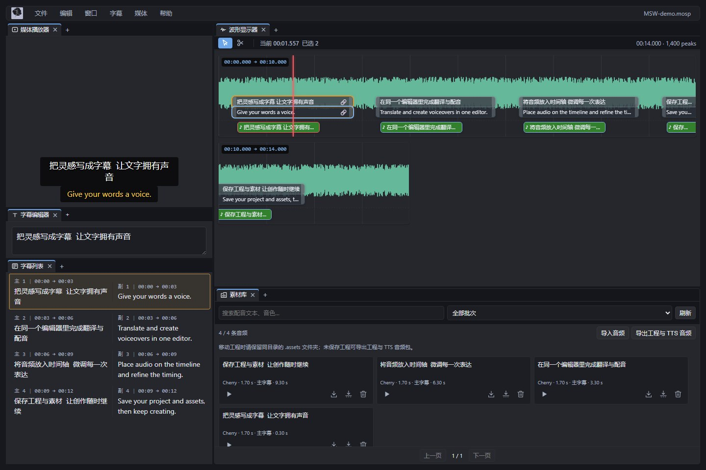

# Moyor's Subtitle Workflow（MSW）

 

MSW（Moyor's Subtitle Workflow / 我的字幕流）是一个聚焦 ASR 与 TTS 的本机 Web 字幕编辑工作流。基于 [Moyf/moys-asr-workflow](https://github.com/Moyf/moys-asr-workflow)，补充了配音、编辑中翻译、素材库与音频贴片，并长期按需引入上游功能和修复。它提供 Windows、macOS、Linux 启动器、命令行和本机浏览器编辑器；字幕编辑与工程保存都在本机完成。

[项目官网](https://github.com/xiaoyaomoyor/moyors-subtitle-workflow) · [下载与版本记录](https://github.com/xiaoyaomoyor/moyors-subtitle-workflow/releases) · [文档目录](docs/README.md) · [环境配置清单](docs/ENVIRONMENT.md)

当前版本为 **1.6.0-beta.2**，基于 MAW 同版本发展；这是 MSW 自己的预发布版本，两个项目的版本号相同不代表功能和兼容性完全一致。

*界面使用合成演示数据；展示当前编辑布局，不代表任何云端音色的真实合成质量。*

## 快速开始

1. 在[版本列表](https://github.com/xiaoyaomoyor/moyors-subtitle-workflow/releases)选择 MSW 安装包。预发布版请进入具体版本，`latest` 可能只显示旧的正式版。各平台与标准／lite 包的区别见[安装与升级](docs/INSTALLATION.md)。
2. Windows 解压并启动 `MSW.exe`；macOS 打开 `MSW.app` / `MSW-lite.app`；Linux 为 AppImage 添加执行权限后运行。
3. 在 Launcher 配置转写服务的 API Key，选择媒体并点击生成。
4. 在 MSWE 中检查、编辑字幕，导出 SRT、ASS 或其他格式。

第一次使用、API 配置、编辑和排错：请从[完整工作流](docs/WORKFLOW.md)开始。

## 核心能力

- 使用 Qwen / Fun-ASR / Soniox / 腾讯云录音文件识别，或 OpenAI（及兼容接口）转写，生成 SRT 与 `.mosp` 工程。
- MSWE Server 编辑器支持波形定位、拆分合并、静音空隙处理、画面预览和多种导出格式。
- MSWE 的「媒体 → TTS」支持选中／整轨字幕配音，也可在字幕编辑器输入独立草稿直接配音，不改字幕。连接、资源、音色与预设管理集中在「全局设置 → 环境配置 → TTS」，调用参数集中在面板的「合成设置」。素材库支持试听、搜索分页、WAV 与工程音频包，见 [TTS 与素材库](docs/EDITOR_TTS.md)。
- 「媒体 → TTS」也支持 [本地油库里配音](docs/EDITOR_YUKKURI.md)：中英文输入、八音色与语速调节；可在编辑器安装资源或加载单独离线资源包，无需 API Key。
- 已安装 IndexTTS 的用户可连接 [IndexTTS 2.5 本机服务](docs/EDITOR_INDEXTTS.md)，选择官方示例或自有参考音频，调节情感、时长与高级参数，生成结果继续用于素材库、贴片和导出。
- 把素材库音频拖到波形显示器即可放置[音频贴片](docs/EDITOR_AUDIO_CLIPS.md)，支持重叠子行、裁剪、静音、RMS 热力图、空隙保护与 1× 同步试听。
- [工程保存与恢复](docs/EDITOR_PERSISTENCE.md)：另存为自动收集 TTS 音频，可勾选收集原媒体；提供素材完整性检查、本机恢复草稿与保存历史。
- [音频导出](docs/EDITOR_AUDIO_EXPORT.md)：从音频贴片导出配音轨或原声混音 WAV，支持空隙移除、峰值保护与后台任务。
- [视频与配音剪辑工程导出](docs/EDITOR_VIDEO_TIMELINE_EXPORT.md)：导出混音 MP4，或包含独立配音音轨、原始 TTS 和字幕的 OTIOZ 素材包。
- MSWE 支持可选的多重字幕：拖入第二条字幕作为副轨，支持主副字幕交换、绑定/解绑、联动编辑、跨轨道吸附，以及 `G` / `Shift+G` / `H` / `B` 快捷操作。
- 公开 CLI 可用于批处理和 AI 自动化，详见[命令行文档](docs/CLI.md)。
- [本地 Qwen3-ASR / FunASR / Faster-Whisper](docs/LOCAL_ASR.md) 和免 Key 的必剪 ASR 均属于实验性入口，仅适合体验。

## 文档

- [完整工作流](docs/WORKFLOW.md) ：安装、配置、转写、编辑、导出和排错。
- [安装与升级](docs/INSTALLATION.md) ：五种发行包、首次启动、升级与已知边界。
- [可选环境](docs/ENVIRONMENT.md) ：FFmpeg、云端服务、本机 ASR、油库里与 IndexTTS。
- [常见问题](docs/FAQ.md) ：Windows 下载解压、启动故障与问题反馈。
- [ASR 服务与配置](docs/PROVIDERS.md) ：服务商选择、Key、费用和隐私边界。
- [编辑器指南](docs/EDITOR_GUIDE.md) ：MSWE 的编辑、保存和导出。
- [字幕按键调整](docs/KEYBOARD_ADJUSTMENT.md) ：快捷键和时间微调规则。
- [命令行与自动化](docs/CLI.md) ：完整参数、范例、Server 管理和退出码。
- [LLM 字幕后处理协议](docs/LLM_POSTPROCESS_PROTOCOL.md) ：后处理的输入输出与安全边界。
- [OCR 字幕去重](docs/OCR_SUBTITLE_DEDUP.md) ：画面字幕识别、禁用规则、视频输入、报告和性能说明。
- [转写后自动处理](docs/POSTPROCESS_PIPELINE.md) ：固定步骤、配置预检、LLM 验证、中间产物和失败恢复。
- [JSON 工程文件规范](JSON_SCHEMA.md) ：`.mosp` / `.json` 数据契约。
- [开发说明](docs/DEVELOPMENT.md) ：产品边界、数据契约和开发检查。

## 重要说明

- 选择云端服务转写时，媒体会直接上传到对应服务商；MSW 没有自己的云端服务器，也不会代管 API Key。
- `.mosp` 工程是字幕真源；SRT 适合普通交付，ASS 可保留主字幕预览选择的字体、字号和文字颜色，但两者都不会保留全部字级时间码、波形和其他工程数据。
- 费用、数据保留和服务可用性以服务商当前政策为准，详见[ASR 服务与配置](docs/PROVIDERS.md)。
- [上游 MAW 的 3 分钟视频速览](https://www.bilibili.com/video/BV1hXum6yELT)（历史操作参考，未涵盖 MSW 新增的配音功能）

## Star History

<a href="https://www.star-history.com/?repos=xiaoyaomoyor%2Fmoyors-subtitle-workflow&type=date&legend=top-left">
 <picture>
   <source media="(prefers-color-scheme: dark)" srcset="https://api.star-history.com/chart?repos=xiaoyaomoyor/moyors-subtitle-workflow&type=date&theme=dark&legend=top-left" />
   <source media="(prefers-color-scheme: light)" srcset="https://api.star-history.com/chart?repos=xiaoyaomoyor/moyors-subtitle-workflow&type=date&legend=top-left" />
   
 </picture>
</a>

## 反馈与许可

MSW 的问题和建议请提 [GitHub Issues](https://github.com/xiaoyaomoyor/moyors-subtitle-workflow/issues)。[上游 MAW 交流群](https://qm.qq.com/q/4YtxZIpzxC)仅作为上游交流入口，MSW 特有问题请在本仓库反馈。

本项目采用 [AGPL-3.0-only](LICENSE)。
