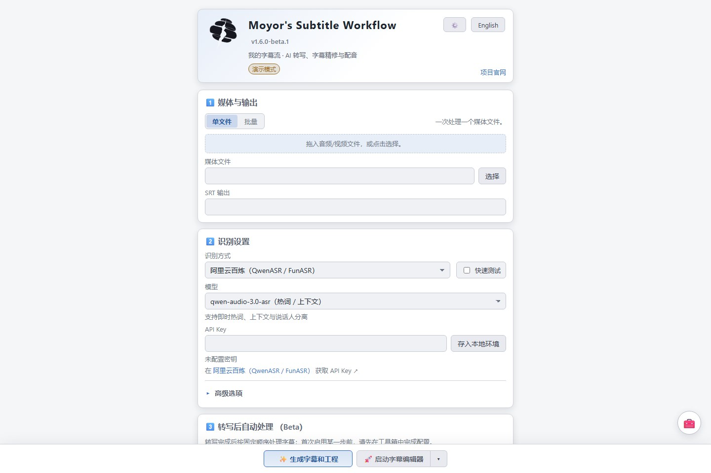

# 安装与升级

从 [MSW Releases](https://github.com/xiaoyaomoyor/moyors-subtitle-workflow/releases) 下载。`1.6.0-beta.2` 是预发布版；`releases/latest` 可能仍指向旧的正式版，应进入带目标版本号的页面。正式上传前，下列文件名表示发行目标，不表示已经可下载。

| 文件 | 系统 | 内置 FFmpeg |
| --- | --- | --- |
| `MSW-Windows-x64-v1.6.0-beta.2.zip` | Windows x64 | 是 |
| `MSW-lite-Windows-x64-v1.6.0-beta.2.zip` | Windows x64 | 否 |
| `MSW-macOS-arm64-v1.6.0-beta.2.zip` | macOS Apple Silicon | 是 |
| `MSW-lite-macOS-arm64-v1.6.0-beta.2.zip` | macOS Apple Silicon | 否 |
| `MSW-Linux-x86_64-v1.6.0-beta.2.AppImage` | Linux x86_64 | 是 |

GitHub 另提供 **Source code (zip)** 和 **Source code (tar.gz)**，包含标签对应的源码，不是可直接启动的应用包。macOS Intel、Windows ARM64、Linux ARM64 暂无本轮官方构建产物。

## 启动

- Windows：完整解压 ZIP，进入目录运行 `MSW.exe`。不要从压缩软件中直接运行，也不要只复制 EXE；`_internal` 与旁边的资源目录必须保留。下载标记造成 DLL 加载失败时见[FAQ](FAQ.md)。
- macOS：解压后打开 `MSW.app` 或 `MSW-lite.app`。当前流程进行 ad-hoc 签名，不包含 Apple 公证；只在确认下载来源后按系统提示允许打开，不建议关闭系统整体安全保护。
- Linux：对下载的 AppImage 执行 `chmod +x MSW-Linux-x86_64-v1.6.0-beta.2.AppImage`，再运行它。目标为 x86_64 图形桌面，构建基于 Ubuntu 22.04；若系统不支持 FUSE，可尝试 `./MSW-Linux-x86_64-v1.6.0-beta.2.AppImage --appimage-extract-and-run`。

标准版包含媒体处理用的 `ffmpeg` / `ffprobe`；lite 需要配置现有 FFmpeg。两者都不自带云端额度或 API Key，也不捆绑大型 ASR / TTS 模型。普通用户无需安装开发用的 Python、Node、Rust 或 npm。

Launcher 打开的是本机 Server 编辑器，地址为 `127.0.0.1`。翻译、TTS、素材收集和媒体导出依赖这个本机服务；直接双击独立 HTML 仍可编辑字幕，但无法替代服务器处理功能。

## 首次配置

1. 需要 ASR 时，在启动器配置对应服务。
2. 在编辑器「编辑 → 全局设置 → 环境配置」设置 LLM 和 TTS；本机 IndexTTS 需先启动它自己的服务，油库里可在此安装独立资源。
3. 打开媒体或字幕，编辑、翻译、配音；生成音频进入素材库，可拖入波形显示器。
4. 保存为 `.mosp` 工程，再按需导出字幕、音频、视频或剪辑工程。完整功能与依赖见[环境清单](ENVIRONMENT.md)。

## 从 beta.1 升级到 beta.2

新写入工程使用顶层 `moy.asr.project.v1`，仍兼容未标版本的 MAW／MSW 历史工程。新缓存与后处理中间文件使用 `_msw`；旧 `_maw`、MSW 与媒体旁路径继续读取，不自动迁移。输出目录／每媒体目录／模型后缀三个偏好的默认值依次为关闭、关闭、开启，详见[输出布局](OUTPUT_LAYOUT.md)。

源媒体 OTIO／OTIOZ 默认附带独立 SRT、包含表情包和字幕标记，三个选项可各自关闭；含配音 OTIOZ 使用独立入口和原有规则。设置分类会记住上次位置，搜索、主题与 LLM／TTS 配置继续保留。

## 升级与迁移

- 先保存工程，备份 `.mosp`、同目录 `.assets` 素材文件夹和原媒体；不要只复制工程文件。
- 退出旧版，新版解压到新目录试用，保留旧版便于回退。不要覆盖正在运行的应用或直接删除用户数据目录。
- 云端 Key、连接与本机资源配置不写入工程。若旧版本在程序目录读取 `.env`，可由用户自行迁移该文件或重新填写配置；不要把它发到 GitHub。
- 浏览器主题／布局与浏览器来源相关；端口变化时可能显示为另一套界面设置。本机任务、恢复历史不保证随工程复制到另一台机器。
- `.mosp` 和旧 `.json` 工程继续兼容；上游 MAW 不保证理解 MSW 的配音扩展，交给其他工具前保留原工程并导出相应格式。

本版本仅在其验证记录列出的平台与条件下确认。源码测试通过不能替代对每个平台实际安装包的启动检查，发布状态见[构建与发布](RELEASING.md)。
