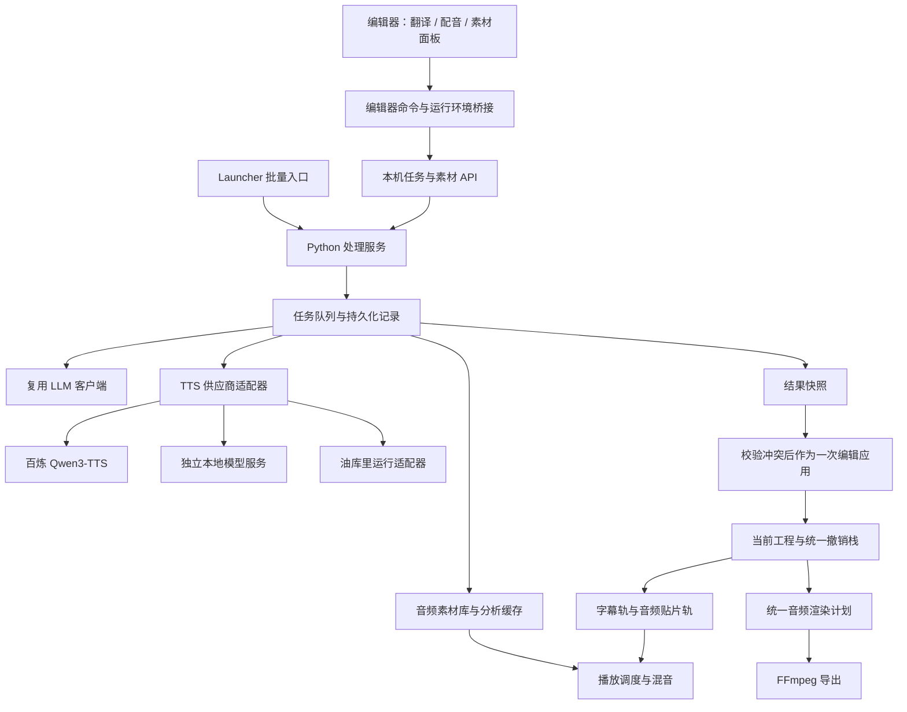

# MSW 编辑器内处理、TTS 与音频贴片架构提案

日期：2026-09-07  
状态：原始提案；A0+A1、B、C、D0、D1 / D2 已落地，实施与验证记录见下文
代码基线：`my-feature` / `7b20929c34ffc85171eb7cda6d3f06524233de13`，本地编辑器版本 `1.6.0-beta.1`。

本提案依据当前本地代码，不包含用户暂缓同步的上游更新；它不表示已完成 API 调用、浏览器试听或性能验收。

2026-09-08 实施更新：B 已提供百炼 TTS 与持久化素材库，用户已确认真实合成正常。C 落地为 `msw-audio-core.js`（采样／时间与 codec）、`msw-audio-transport.js`（缓存、缓冲、播放）和 `msw-audio.js`（时间轴与操作），复用现有命令、历史和素材 API。按用户确认，重叠贴片分子行同时发声，空隙默认保护配音覆盖区间，可切换为随媒体跳过；不额外弹冲突审批。第一版选择明确标注的 RMS dBFS 热力图（约 400ms／100ms、固定 −60 至 −6 dBFS），LUFS、淡入淡出、最终混音测量与导出留待后续。缺素材保留引用，恢复原素材目录后重载。用法见 [音频贴片](../EDITOR_AUDIO_CLIPS.md)，验证见 [C 阶段记录](../TEST_FEEDBACK_EDITOR_AUDIO_CLIPS.md)。以下保留提案时的设计背景，不把未来建议当作已实现能力。

2026-09-08 D 阶段更新：D0 已实现工程保存、素材收集与本机恢复；D1 / D2 通过 `audio_plan.py` 和 `msw-audio-render-core.js` 共用契约夹具，新增 `audio_render.py` 分块浮点混音、`audio_exports.py` 快照任务及下载。支持配音轨／原声混音 WAV、原声音轨选择、源范围、空隙保护／随媒体裁切和全局峰值衰减，界面位于「文件 → 导出音频」。试听重用同一时长、电平与空隙保护规则；视频渲染、淡入淡出编辑与 E 引擎仍未实现。用法见 [音频导出](../EDITOR_AUDIO_EXPORT.md)，验证见 [D1 / D2 记录](../TEST_FEEDBACK_EDITOR_D1_D2.md)。

## 1. 已确认的产品方向

- MSW 长期独立维护，从 MAW 定期吸收功能与修复，不以向上游提交 PR 为目标。
- `main` 保留上游同步用途，`my-feature` 承载 MSW 定制；本次不同步上游。
- 用户在编辑器内选择字幕，进行 LLM 翻译、添加副字幕、生成 TTS，同时继续其他编辑。
- 第一版 TTS 使用阿里云百炼 Qwen3-TTS 云端 API。
- 音频贴片显示配音文本，背景沿时间展示音频响度热力图；不是整块按增益着色，也不是播放时闪动。
- 后续接入本地 GPT-SoVITS、IndexTTS、中文油库里。用户所说的“GPTV4”暂按 GPT-SoVITS v4 理解，具体接入阶段再核对。

推荐继续以本机 Server 编辑器为完整功能入口。Launcher 保留批量导入、初次转写和设置入口；便携 HTML 保留字幕编辑，按实际运行能力启用扩展功能。Tauri 暂不成为本轮前置条件。

## 2. 当前代码能提供什么

| 已核对的入口 | 现状 | 对本方案的影响 |
| --- | --- | --- |
| `edit.py`、`web/editor-scripts.txt` | 同一套 `web/` 源码内联为便携页面，也供 Server/Tauri 装配 | 新模块继续加入现有清单，避免两套前端 |
| `server-editor/serve.py:EditorServer` | 已有 `ThreadingHTTPServer`、后台波形任务、工程保存、媒体服务、部分请求令牌检查 | 可以挂接任务和素材 API；现有波形线程不是通用任务系统 |
| `maw/gui_web.py`、`maw/gui_workflow.py` | Launcher 管理设置、转写进程和后处理 | 新编辑器不依赖调用 Launcher 窗口或模拟按钮 |
| `maw/postprocess.py:run_llm_postprocess` | 读取工程文件、分批处理、验证、写出新产物；翻译已有一对一约束 | 提取面向内存快照的处理入口，保留文件入口包装 |
| `maw/postprocess_llm.py` | 已有供应商、请求、流式输出和诊断处理 | 复用 LLM 客户端，避免重新实现一套翻译调用 |
| `docs/MULTI_SUBTITLE.md`、`maw/project.py` | 主字幕稳定 ID、副字幕轨、绑定关系已经存在；当前界面管理一条副轨 | 翻译第一版直接写入现有副轨，不重建多字幕系统 |
| `web/editor.js:buildJson/applyCanonicalProject` | 保存与打开按已知字段重建工程 | 新字段必须显式接入两个方向，不能仅在内存赋值 |
| `maw/project.py:_normalize_copy` | Python 深拷贝工程后验证；未知顶层字段可随拷贝保留 | 仍需新增 MSW 字段验证，且不能据此推断旧前端也能保留字段 |
| `web/editor.js:snapshotSegments/applyHistoryRecord` | 主副字幕共用撤销栈，另有布局、空隙与预览记录 | 扩展同一个历史栈，避免配音和字幕各自撤销导致错序 |
| `web/gap-remove-core.js` | 保留源时间，并计算移除空隙后的派生时间 | 配音也必须经过同一时间映射 |
| `web/editor-runtime.js` | 已有 `MSWE.register/resolve` 工厂注册机制 | 可直接装配新模块，无须先换框架 |

当前 `editor.js` 约 2.04 万行、`waveform.js` 约 0.65 万行。文档中的旧统计明显更小；新增功能应主要落在独立文件，通过少量显式接口连接旧编辑器。

### 原作者为什么采用“先处理，再编辑”

不能从代码确定作者全部主观动机。根据当前实现、[工作流](../WORKFLOW.md)、[后处理流程](../POSTPROCESS_PIPELINE.md)和[渐进式重构企划](MAWE%20前端渐进式重构企划案.md)，合理推断是：

1. Python 适合调 FFmpeg、文件系统、云端 API 和本地模型；浏览器负责交互，便携 HTML 无须常驻后端。
2. 长任务先产出 `.mosp`，编辑器打开相对稳定的结果，可以避开后台返回结果与人工修改之间的冲突。
3. 以文件串接步骤天然适合批处理、失败重试和保留中间产物。

这些是合理的产品取舍，不是浏览器不能在编辑时处理。MSW 已有本地后端，下一步是把处理能力变成可在编辑器发起的后台任务。

## 3. 总体结构与状态所有权



这是逻辑分层。第一版仍只有现有 Python 本地服务加浏览器，不引入远程后台、Redis、Celery、微服务或框架迁移。油库里若采用浏览器执行，其适配器可以通过受控回传进入同一结果和素材流程，并不要求所有引擎都跑在 Python 进程里。

| 数据 | 唯一所有者 | 持久化位置 |
| --- | --- | --- |
| 当前未保存编辑 | 前端工程状态，经命令修改 | 用户保存时写入 `.mosp` |
| 字幕文本和时间 | `segments` / `multi_subtitle` | `.mosp` |
| 音频文件及合成来源 | 素材库；音频文件不可原地覆盖 | 工程素材目录 + `.mosp` 中的引用与配方 |
| 贴片位置、裁剪、增益 | 前端工程状态 | `.mosp` 的 MSW 扩展 |
| 任务进度、失败、待应用结果 | Python 任务管理器 | 用户数据目录中的轻量 SQLite 与结果文件 |
| 波形、响度、重采样和伸缩音频 | 可重建缓存 | 素材缓存目录 |
| API Key 与本机模型地址 | 本机配置服务 | 现有本机配置机制；工程只留配置引用 |

任务成功不等于修改工程。后台产生结果和素材；只有前端应用结果的命令才能改变当前工程。Launcher 文件流程继续由其文件包装入口生成新工程。

## 4. 编辑器内任务：先解决结果如何安全回来

### 4.1 输入必须来自当前编辑快照

提交前先提交正在输入的字幕文本，再读取当前选区。不能读取磁盘旧工程替代用户正在编辑的内容。

任务输入包含：

```text
job_id / idempotency_key
project_id / editor_session_id / project_generation
operation / provider_profile_id / resolved_settings_snapshot
source_track_id / source_segment_ids
source_text_snapshot / source_content_hash
source_timing_snapshot
target_track_id / target_content_hash
context_snapshot / context_hash（如果翻译读取上下文）
```

- 字幕始终以稳定 ID 标识，不把当前数组下标当作身份。
- `project_id` 持久化在 MSW 扩展中；`project_generation` 是本次页面打开/切换工程的代际，切换后旧请求不能落入新工程。
- 设置在提交时解析并快照；排队期间改模型或音色不会偷偷改变已有任务。
- 不把字幕时间默认视为 TTS 合成输入；它主要影响放置，文本和声音参数才影响合成。只有支持目标时长的任务才把时长纳入合成指纹。
- 翻译可附带邻近上下文，但明确哪些是待输出字幕、哪些只供参考；一并检查读过的上下文是否变化。

### 4.2 结果应用规则

默认结果进入任务/配音面板预览，用户点击“应用译文”或“放入时间轴”。以后可提供自动应用无冲突结果的偏好，但必须执行相同校验。

| 运行期间发生的变化 | 应用行为 |
| --- | --- |
| 编辑其他无关字幕 | 正常应用，不锁整个工程 |
| 只改变来源字幕时间 | 根据当前时间重新放置/绑定；不必重新合成，展示新的放置范围 |
| 来源文本、合成参数或相关上下文改变 | 标为结果过期，保留试听/对比；选择重新生成或明确使用旧快照 |
| 目标副字幕已被人工修改 | 不覆盖；逐条对比后选择保留或替换 |
| 来源字幕删除、拆分、合并、主副交换导致身份映射改变 | 保留候选结果，重新选择目标；不猜测映射、不复活旧字幕 |
| 切换工程或旧页面晚到响应 | 结果仍属于原工程任务，禁止写入当前工程 |
| 用户在文本框里仍有尚未提交的输入 | 应用前先提交并再次比较，或等待结束编辑；不能只检查旧的 `DATA` |
| 同一结果重复到达或刷新后再次应用 | 通过结果 ID 和工程中已应用记录去重，避免重复插入 |

应用时在一次同步命令中完成“校验 → 拍摄撤销前状态 → 修改 → 标脏 → 局部刷新”。不要在校验和修改之间等待网络。结果预览期间继续编辑，点击应用时必须重新校验。

第一版不自动运行“改字 → 翻译 → TTS”的付费连锁反应。用来源指纹标记派生内容过期，由用户批量重新生成。

### 4.3 任务执行与恢复

```text
queued → running → succeeded / failed
queued 或 running → cancel_requested → cancelled
进程异常退出 → interrupted / unknown_outcome

结果应用状态独立：pending / applied / discarded / stale
```

TTS 批量任务按字幕拆成子任务，LLM 按上下文和长度分批。部分失败不会抹掉其他成功音频。界面显示真实阶段和“已完成 N/M”；模型没有可知进度时显示正在生成，不伪造百分比。

云端请求用有界线程池；FFmpeg 用可终止子进程；本地 GPU 引擎按设备/模型设并发预算，起步单任务。HTTP 返回 `202 + job_id`，不让请求线程等待整个合成过程。初版用带递增版本号的短轮询即可，空闲停止轮询；以后有需要再增加 SSE，无须 WebSocket。

SQLite 使用短事务及串行写入管理，不跨网络请求持锁。提交、每条子结果、取消和应用确认都持久化。页面刷新后恢复列表；服务重启后不把所有 `running` 都当失败自动重发。

本机幂等键能防双击提交，不能保证云端只计费一次。遇到“服务商可能成功但本机超时”的情况，记录请求 ID 与 `unknown_outcome`，有查询能力则查询，无法确认则提示再次生成可能重复调用。取消首先停止排队与后续处理；已发出的云请求不承诺取消计费。已知 URL 的下载失败优先重试下载，不重新合成。

### 4.4 本机接口与多窗口

建议统一放在 `/api/msw/` 下：

| 接口 | 用途 |
| --- | --- |
| `GET /api/msw/capabilities` | 本运行环境的翻译、TTS、素材、导出能力 |
| `GET /api/msw/providers` | 供应商、模型、音色及能力描述，不返回 Key |
| `POST /api/msw/provider-profiles` | 编辑器中更新本机配置，返回遮罩和配置状态 |
| `POST /api/msw/jobs` | 提交快照任务，返回 202 |
| `GET /api/msw/jobs?project_id=...&since=...` | 增量读取任务与结果状态 |
| `POST /api/msw/jobs/{id}/cancel` | 请求取消 |
| `GET /api/msw/jobs/{id}/result` | 读取可应用结果，作用域限于当前授权工程 |
| `POST /api/msw/jobs/{id}/ack` | 记录应用/丢弃确认，支持幂等 |
| `GET /api/msw/assets/{asset_id}/audio` | 按注册素材 ID 提供音频，支持 Range |
| `GET /api/msw/assets/{asset_id}/analysis` | 读取波形和响度分析 |
| `POST /api/msw/assets/import` | 导入浏览器选取的音频或受控本机文件 |
| `POST /api/msw/exports` | 基于工程快照创建导出任务 |

沿用监听 `127.0.0.1` 的边界。新增接口验证请求令牌、Origin/Host、工程会话和输入大小；浏览器不直接带 Key 调云端，不把任意 URL/路径变成后端代理或文件读取接口。素材 URL 由服务端受控解析，下载需校验协议、重定向和目标，防止供应商响应被当作任意网络访问指令。

现有服务对象只有一个可切换的 `self.project`；现有保存锁只是防同时写入，不能防旧页面覆盖新工程。首阶段增加当前编辑会话令牌、工程绑定标识和磁盘保存版本/指纹检查，并把它接入现有保存/切换入口。默认同一工程一个写会话，其他窗口只读或明确接管；晚到的保存与任务回复均须拒绝过期绑定。无需扩展到实时多人协作。

## 5. 翻译与副字幕

操作流程：选中主/副字幕 → 翻译面板选择目标语言与模型 → 后台处理 → 逐条预览 → 一次应用到副轨。

保留 `segments` 为主轨真源、`multi_subtitle` 为副轨与绑定真源。第一版界面仍管理一条副轨：已有副轨时，明确选择更新选中字幕对应的译文、替换副轨或取消；不悄悄创建当前界面无法管理的第三条字幕轨。

从 `run_llm_postprocess` 提取公共内存入口，例如：

```text
process_subtitle_snapshot(snapshot, operation, llm_client, progress, cancellation)
    → validated_result + warnings

现有 run_llm_postprocess：读文件 → 公共入口 → 写产物
编辑器任务：接收快照 → 公共入口 → 返回结果补丁
```

保留上游的一对一校验与缺项修复预算，把段 ID 映射、上下文、取消检查公开到服务层，不让新模块大量调用上游私有函数。若第一批改动必须缩小，可以临时使用独立任务目录中的快照文件调用旧入口；必须只消费快照，并把这层文件包装明确记录为过渡适配器。

翻译只能输出来源 ID 对应的文本，不能自行移动字幕边界。新译文没有真实字词时间戳，不复制原文 `items`；保持段级时间，并建立真实主副 ID 绑定。校对与重新断句以后接同一任务服务，但拆分/合并需额外输出身份映射，不能冒充一对一翻译。

## 6. TTS 供应商与声音配置

### 6.1 共用配置体验，区分各引擎能力

ASR 的供应商卡片、地域选择、连接设置和遮罩交互可以复用；不要把 TTS 参数塞进只描述 ASR 的 `ModelConfig`。新增 TTS 能力类型，同时通过配置服务读取现有百炼凭据引用。

```text
TtsProvider.describe() → 模型能力、限额、支持参数
TtsProvider.list_voices(profile) → 内置目录或供应商查询结果
TtsProvider.validate(request) → 参数错误或合法请求
TtsProvider.synthesize(request, cancellation, progress) → 音频产物与供应商元数据
```

公共请求使用文本、语言、声音预设、可选指令/参考音频；供应商专属参数留在带命名空间的 `options` 中。能力描述分别声明 `stock_voice`、`reference_voice`、`instructions`、`native_speed`、`target_duration`、`streaming`、`word_timestamps` 等，不能因为都叫 TTS 就假定功能一致。高级选项按当前模型能力显示，后端同样校验。

声音预设分成“本机供应商连接配置”与“可随工程保存的声音配方”。配方包含 provider、实际请求 model、voice、语言、参数和参考音频素材 ID；Key、本机 GPU 路径和临时签名 URL 不进入工程。模型别名不能保证未来音色完全相同，记录实际请求名、已知模型快照版本与调用时间。

### 6.2 百炼第一版

采用非实时 HTTP 合成，以 `qwen3-tts-flash` 为起始配置；指令控制作为 `qwen3-tts-instruct-flash` 的独立能力开放。它们与 Qwen ASR 的请求格式不同。

北京接口的文档示例为：

```text
POST https://dashscope.aliyuncs.com/api/v1/services/aigc/multimodal-generation/generation
```

```json
{
  "model": "qwen3-tts-flash",
  "input": {
    "text": "今天我们来编辑一段字幕。",
    "voice": "Cherry",
    "language_type": "Chinese"
  }
}
```

以上是接口形状，不是固定产品默认音色。地域、音色目录、长度上限和模型能力由该适配器维护，并在实施时重新核对。当前官方文档列出 Qwen3-TTS 单次文本上限为 600 字符；超长字幕在提交前提示或按句拆成子请求，保留原字幕到合成片段的映射。不能假定它存在通用 `/voices` 或兼容 ASR 的端点。

返回的完整音频 URL 有时效，收到结果后由后端尽快下载、校验并保存本地。FFprobe 读取真实时长、采样率和声道，不按文本长度或预期编码推算。只有音频可靠落盘，才把子任务标为可用。官方接口与 URL 时效见 [Qwen-TTS API](https://help.aliyun.com/zh/model-studio/qwen-tts-api)，模型与地域见[非实时合成指南](https://help.aliyun.com/zh/model-studio/non-realtime-tts-user-guide)。

第一版不需要实时语音会话：后台生成完整的每条字幕音频，生成完一条即可试听一条。以后可加流式试听，最后仍以完整文件作为保存真源。

### 6.3 本地引擎

GPT-SoVITS 和 IndexTTS 放在独立环境/进程内，MSW 通过本机适配器访问，避免 PyTorch、CUDA、Transformers 依赖进入编辑器主运行环境。

- GPT-SoVITS 的[官方 `api_v2.py`](https://github.com/RVC-Boss/GPT-SoVITS/blob/main/api_v2.py)已有 `/tts`，包含参考音频、提示文本和合成速度等参数。适配器负责转换、取消边界及音频接收；参考音频由登记素材映射到该服务实际能读的路径。
- [IndexTTS](https://github.com/index-tts/index-tts)提供 Python 推理调用；不能假定用户启动的所有 WebUI 都有相同 HTTP API。选定具体版本后包装一个受控本机 worker/API，分别描述参考声音、情绪、语言和时长能力。
- 第一轮本地接入以连接用户已启动的服务为主。模型下载、显卡管理和一键安装另作阶段，不成为云端 TTS 上线前置条件。

### 6.4 中文油库里：按指定仓库接入

用户给出的 [zh-yukkuri.js README](https://raw.githubusercontent.com/Love-Kogasa/zh-yukkuri.js/main/README.md)已通过公开 raw 地址核对。它是 `aquestalk.js` 的中文包装，示例为 `yukkuri.load(zip, dll, options)`、`aqtk.run(text)`、`destroy()`，需要 `v86.wasm`、DLL 和拼音到假名映射。其 [package.json](https://raw.githubusercontent.com/Love-Kogasa/zh-yukkuri.js/main/package.json)还列出数字转换、拼音和假名相关依赖。

底层 [aquestalk.js](https://github.com/y52en/aquestalk.js)说明可在浏览器或 Node.js 中使用 WASM/v86。它与同作者调用 yukumo.net 的在线 `zh-yukuuri` 项目不同，不能混用后者的接口描述。

推荐先尝试独立 Node worker，以同一个素材服务持久化 WAV；浏览器 Worker 是可选替代，需验证该库的依赖加载和运行要求。这里的“Worker”是隔离边界设计，尚未实测该包装在两种宿主下的兼容性。

把 `display_text`、`spoken_text`、`pronunciation_override` 分开：中文原文用于贴片展示；数字读法、多音字、假名转换用于实际合成。保存转换版本和最终输入，避免换词典后无法解释读音变化。DLL/运行时包由用户配置，具体分发方式在实施前按依赖官方说明核对；包装库的开源状态不能替代其底层依赖要求。

## 7. 工程模型：字幕、音频素材、音频贴片

三者具有不同生命周期：

- 字幕是“在什么时间显示什么字”。
- 音频素材是“一份实际生成或导入的声音”。
- 音频贴片是“这份声音的哪个部分，在时间轴哪里，以什么增益播放”。

一个素材可以被多个贴片引用；一条字幕可以有多次生成的声音候选；删字幕不自动删除音频，删贴片不立即删磁盘素材。贴片也可来自导入的普通 WAV，不强制必须绑定字幕。

### 7.1 建议的可选扩展

保持 `.mosp` 为 JSON，顶层新增 MSW 自有命名空间 `msw`。下面是示意结构，字段规范及迁移必须在实现阶段同步写入 `JSON_SCHEMA.md`：

```json
{
  "segments": [
    {"id": "main-001", "start": 1000, "end": 3000, "text": "你好，世界。"}
  ],
  "msw": {
    "schema": "msw.editor.v1",
    "project_id": "project-uuid",
    "assets": [
      {
        "id": "audio-001",
        "kind": "audio",
        "path": "demo.assets/audio/audio-001.wav",
        "sha256": "content-hash",
        "sample_rate": 48000,
        "channels": 1,
        "sample_count": 96000,
        "generation": {
          "provider": "dashscope-qwen-tts",
          "model": "qwen3-tts-flash",
          "voice": "Cherry",
          "language": "Chinese",
          "display_text": "你好，世界。",
          "spoken_text": "你好，世界。",
          "options": {}
        }
      }
    ],
    "audio_tracks": [
      {"id": "voice-1", "name": "配音", "gain_db": 0, "muted": false}
    ],
    "audio_clips": [
      {
        "id": "clip-001",
        "track_id": "voice-1",
        "asset_id": "audio-001",
        "start_ms": 1000,
        "source_in_sample": 0,
        "source_out_sample": 96000,
        "playback_rate": 1,
        "gain_db": 0,
        "fade_in_ms": 0,
        "fade_out_ms": 0,
        "label": "你好，世界。",
        "source_ref": {
          "track_id": "main",
          "segment_ids": ["main-001"],
          "text_hash": "source-text-hash"
        },
        "placement_mode": "independent"
      }
    ],
    "derivations": [],
    "applied_results": []
  }
}
```

时间约定：字幕继续保存整数毫秒；贴片起点为源时间轴的整数毫秒；素材裁剪用整数采样帧，`source_out_sample` 为不包含的末端，`sample_count` 是每声道采样帧数。第一版 `playback_rate` 仅允许 1。

```text
clip_duration_ms = (source_out_sample - source_in_sample) / sample_rate / playback_rate × 1000
clip_end_ms = start_ms + clip_duration_ms
```

结束点由素材与裁剪决定，不同时保存一个可独立编辑的 `end_ms`。界面显示时取整，内部换算不反复取整；帧网格控制吸附，不把音频采样精度降低到视频帧精度。日后保音高伸缩应生成带配方的派生音频，不能直接把 Web Audio `playbackRate` 当成保音高变速。

`source_ref` 用于追溯和过期提示，不建立隐式强联动。默认贴片独立移动；可选 `follow_start` 只跟随字幕起点及偏移，不强制结束点相同。字幕删除后解除可执行的跟随关系，但保留历史来源；拆分/合并后默认要求重新绑定。编辑贴片标签不会改变已经录制的发音；配音文本编辑应形成新的待生成配方，成功后替换素材引用。

`derivations` 保存译文等派生内容的来源/目标 ID 和指纹，不再复制一份字幕真源。所有引用、迁移和未知字段保留由 MSW codec 负责。

### 7.2 时长不一致的处理

例如字幕是 2 秒，而实际 TTS 是 2.7 秒：默认放入完整 2.7 秒音频，标明超出 0.7 秒和相邻重叠。不能直接剪掉结尾，也不能为了塞进字幕范围自动高速播放。

第一版允许用户移动、裁剪或重新生成。后续提供显式选择：修改文案、改原生语速、保音高适配时长、延长字幕。多个贴片允许叠加，不使用字幕“不重叠”的验证规则；画面不自动随配音变长。超出源媒体尾部的内容需在混合视频导出时选择截断或延长画面，未选择前不静默丢弃。

逐字幕合成便于选择、失败重试和替换，但跨句韵律可能较碎。后续增加“按句群生成”，以一份素材加分段来源映射表示；若要自动逐词高亮，需引擎真实时间戳或额外对齐任务，不能按字数均分伪造。

### 7.3 素材持久化和保存

```text
demo.mosp
demo.assets/
  audio/       原始生成音频和用户导入音频
  references/  用户选择随工程携带的参考音频
  cache/       可重建的波形、响度、混音、伸缩产物
```

- 工程内记录相对路径和内容哈希，正常搬移包含工程与素材的目录即可重连。
- 云端输出先写临时文件、验证、原子改名；再让工程引用它。不得先保存引用再下载音频。
- 未绑定本机目录的空白/浏览器工程可先生成到应用暂存区并试听，随后选择受控的工程目录或导出包含素材的工程包。File System Access 文件句柄不等于 Python 可用的绝对路径，必须通过已有本机选择/登记流程或文件上传明确绑定。
- 保存失败保留候选素材，重新打开可恢复；暂存区不能被当作已经永久保存。
- 另存为到新目录时先复制/验证所需素材，再原子写工程；素材目录名不依赖打开时临时猜测。
- `.mosp` 保持 JSON；“打包工程”另输出 ZIP，包含清单、`.mosp` 与素材，不让同一扩展名兼具 JSON 和 ZIP 含义。
- 只对不再被工程、撤销/重做记录、备份或待应用任务引用的素材执行显式清理；第一版不自动删除生成音频。
- 重新生成产生新素材 ID，替换贴片引用；撤销恢复旧引用，重做无需再请求云端。

### 7.4 兼容性必须实测

新版本能无损读取旧工程，不代表旧 MAW/MSW 能无损保存新工程。当前旧前端已被证实会按固定字段重建 JSON。因此增加“导出 MAW 兼容字幕副本”，明确该副本不含音频贴片；不要建议在旧版本打开并覆盖保存含配音的原工程。

codec 在导入、规范化、保存、另存为、撤销/重做、备份恢复和便携导出链路都需要接入。切换到没有 `msw` 的工程时要清空旧扩展，防止跨工程残留。可识别的新 schema 逐版迁移；未知更高版本保留原数据并禁止编辑不理解的扩展，必要时只导出字幕副本。

## 8. 时间轴、响度热力图、播放与导出

### 8.1 贴片轨道

在现有时间尺和波形区域新增“配音”lane，共用缩放、滚动、播放头和吸附坐标。音频有独立命中测试、选区与拖拽控制器；字幕和音频只共享时间坐标、网格与基础选择工具，不复用字幕专属的绑定/禁止重叠规则。

初期一条配音轨即可，数据允许多轨。贴片显示配音文本、微型波形、响度底色和过期/缺失/静音状态。拖动移动，边缘裁剪，后续再加入淡入淡出控制点。重叠片段分行堆叠，颜色和文字仍可读。用户焦点在配音轨时删除/禁用只作用于音频选区；要明确混合选区语义，避免现有字幕快捷键误删。

通过 `TimelineHost` 提供 `timeToX/xToTime`、可视范围、布局变化和指针仲裁；音频模块不读取波形内部私有变量。Canvas 只绘制可视贴片及可见区间，不为每个响度采样创建 DOM 节点。

### 8.2 响度热力图的准确定义

用户选择的是音频沿时间变化的响度。默认展示贴片自身在工程中的响度，计入贴片/轨道增益和淡入淡出，位于主混音处理之前；系统音量和耳机监听旋钮不改变颜色。

建议默认使用 Momentary LUFS：约 400ms 分析窗口、100ms 更新步长，适合看到一句话内部的强弱变化；分析短到不足一个完整窗口的片段时显示无足够数据，或明确切换到 RMS 电平视图。RMS dBFS 与 LUFS 是不同指标，不能换个单位标签就视为感知响度。

[FFmpeg ebur128](https://ffmpeg.org/ffmpeg-filters.html#ebur128)可提供 Momentary/Short-term/Integrated 指标。保留真实采样时间和声道规则；基础波形 min/max 只有峰值信息，不能用它反推 RMS 或 LUFS，必须从音频重新分析。

- 使用工程一致的固定色标和图例，初始显示范围可用约 -48 到 -8 LUFS，后续由样本调校；这是显示范围，不是交付响度标准。
- 静音/低电平使用暗色，较强部分逐渐过渡到亮色；选中态用描边，错误和削波用单独标记，避免混淆。
- 相同响度在不同贴片中应是相同颜色，不逐块自动归一化。
- 统一增益可以直接给对应的 LUFS 曲线加 dB 偏移；淡入淡出、变速、压缩等时变处理需重新分析实际处理后的音频，交互中若用近似预览应在后台完成后更新，不能假称精确值。
- 某个贴片颜色正常不代表多轨混音没有削波。主混音另设峰值表/削波检测。
- 分析缓存键包含素材哈希、算法版本、声道模式、窗口/步长与处理配方。缩放用多分辨率缓存；RMS 降采样在线性能量域聚合后转 dB，不直接平均 dB 数值。

### 8.3 播放调度

新增 `AudioTransport`，统一处理播放、暂停、Seek、循环、缓冲、切换工程、变速和跳过空隙。源视频/原音频继续按流播放；短配音素材用 Web Audio 解码并按当前播放位置附近按需缓存，设置解码内存预算。不要解码整部视频到浏览器内存。

浏览器预览第一阶段沿用源媒体作为同步参考，在 `AudioContext.currentTime` 上建立映射并预排约 100–200ms 的音频；`seeking/waiting/pause/ratechange` 立即撤销旧调度，稳定后重建，防止 Seek 后旧配音继续发声。`requestAnimationFrame` 用于画面刷新，`timeupdate` 只作状态观察，不承担音频起播精度。[MDN](https://developer.mozilla.org/en-US/docs/Web/API/HTMLMediaElement/timeupdate_event)指出其频率随负载变化。

每个 `AudioBufferSourceNode` 只能启动一次；重复播放/Seek 创建新节点并复用解码缓存。其 `playbackRate` 会改变音高，后续保音高变速必须采用单独 DSP/派生音频。[MDN AudioBufferSourceNode](https://developer.mozilla.org/en-US/docs/Web/API/AudioBufferSourceNode)说明了这两个限制。

多个 HTMLMediaElement 无法提供采样级锁定。MVP 以听感同步、Seek 后无残留、1× 播放为验收目标；待实测决定是否需要统一原音频代理和更强的音频时钟。带配音时尚未实现的保音高倍速应明确不可用，不能继续显示为完整支持。

### 8.4 空隙移除与原音频

贴片保存在源媒体时间轴；与 `gap_remove` 共用 `TimeMap`/保留区间。不能只移动贴片起止两端，因为跨被移除区间的贴片可能需要分割并调整素材入点。

新空隙扫描默认将启用配音覆盖的区域视为受保护候选。向已经标为移除的区间放入配音时显示冲突，由用户选择“保留配音所在区间”或“配音随画面裁切”；未解决前不允许悄悄导出丢失声音的结果。选择随画面裁切后，在每个保留区间求交、分片、映射源采样位置，预览与导出使用同一个计划。

原视频声音默认保留，配音以额外轨混入，可单独静音/调节源音轨。后续增加 ducking 时说明它只是压低整个原音轨；若要保留音乐同时去掉原人声，需独立的人声分离功能，TTS 本身不提供这个能力。

### 8.5 导出从最小闭环开始

优先顺序：单条 WAV → 带时间安排的配音轨 WAV → 原声与配音混音 WAV → 带混音的视频 → OTIO/剪辑软件工程增强。

定义规范化的音频渲染计划，包含素材片段、源入出点、源流选择、时间映射、增益、淡入淡出、静音和输出范围。前端从当前工程本地编译预览计划，拖动和调增益不等待 HTTP；后端根据导出快照独立验证并编译对应计划。Web Audio 与 FFmpeg 各做薄解释器，用共同输入/预期计划夹具约束两端编译器，核对时间与电平，避免两端业务决定逐渐分叉。后台响应携带工程代际和计划版本，旧分析/渲染结果不能替换新编辑的预览。

视频导出在容器/编码兼容时复制视频流并重新编码混音轨；兼容性由导出器检测。长项目分批渲染或先成轨，避免数千输入触发命令行长度、句柄和内存限制。导出使用提交时的快照，期间继续编辑不改变正在导出的结果。

## 9. 代码组织与上游同步

实施说明（A0+A1）：当前前端装配清单仅接受平级 JS 文件，因此落地为 `web/msw-project.js`、`web/msw-translation-core.js`、`web/msw-processing.js`，通过 `processing-host` 窄接口调用编辑器。后台以 `maw/msw/api.py`、`jobs.py`、`config.py`、`project_codec.py` 实现最小完整链路，队列与 SQLite 暂合在 jobs.py；`maw/postprocess.py` 提供共用内存入口。后续 TTS/素材/音频模块仍为本提案的后续阶段，尚未实现。

任务存储按端口隔离；同端口服务恢复时将未完成任务标记中断，已完成结果可手动检查应用。刷新后不自动应用旧页面任务，避免与未保存编辑混淆。A0 采用源码文本、目标文本、绑定与轨道身份逐条比对；允许期间调整时间并保留调整，不依赖整工程锁来阻止编辑。首次旧工程身份、部分结果应用记录及旧版本保存边界见 `JSON_SCHEMA.md`。

建议新增以下模块，名字可在实施时微调：

```text
maw/msw/
  api.py                  # /api/msw 路由适配，不拥有 GUI
  jobs.py                 # 队列、取消、状态与恢复
  job_store.py            # SQLite 与结果持久化
  config.py               # 连接配置与密钥引用
  processing.py           # 翻译/合成服务编排
  project_codec.py        # msw 扩展的验证与迁移
  assets.py               # 素材登记、保存、重连
  audio_analysis.py       # 波形/响度缓存
  audio_render.py         # 音频渲染计划与 FFmpeg
  tts/
    base.py               # 请求、结果、能力契约
    qwen.py
    gpt_sovits.py          # 后续
    index_tts.py           # 后续
    yukkuri.py             # 后续宿主适配

web/msw/
  editor-host.js          # 旧编辑器的窄接口与命令
  project-codec.js        # 与 Python 使用共同契约夹具
  task-client.js
  processing-panel.js
  tts-panel.js
  asset-panel.js
  audio-clips.js
  audio-timeline.js
  audio-transport.js
  msw.css
```

只在现有文件增加明确挂接点：

1. `serve.py` 装配 MSW 服务、路由和会话检查。
2. `editor.js` 暴露读取快照、执行命令、保存扩展、项目切换、选择和播放事件。
3. `waveform.js` 暴露共享时间坐标与 lane 插槽。
4. `editor-scripts.txt` 与页面样式装配增加新模块；继续生成便携页面。
5. `maw/project.py` 调用扩展验证；`postprocess.py` 提取公共内存入口。

使用现有 `MSWE.register`，静态装配这些模块。新模块通过显式注入使用 `EditorHost`，不猴子补丁旧函数、不依赖全局变量名称、不动态执行第三方插件。先为新功能提供命令边界，再逐步迁移碰到的旧命令；不要求先把两万行编辑器全部重构完。

### Git 维护建议

现有分支策略适合长期独立维护。`ahead/behind` 表示提交历史分叉，不代表工程损坏；具体数值以用户所看的比较对象与时点为准，本提案没有刷新远端引用来重算。

需要吸收上游时：让 `main` 通过 fast-forward 跟进选定上游版本，再从 `my-feature` 建一次性集成分支，merge `main`，解决冲突并验收，最后并回 `my-feature`。长期已共享的定制分支优先 merge，避免每次 rebase 重放全部定制。若某批更新明确不需要，可以单独 cherry-pick 必需修复，但记录来源，避免随后整批合并时重复排查。

把 MSW 大部分实现放进自有目录能降低冲突面，但无法消除语义冲突。每次同步重点审查保存/载入、稳定 ID、多字幕绑定、历史、时间轴、播放、导出和打包入口。新增 contract tests 保护这些接口，而不只检查是否出现 Git 冲突。

本轮不改分支策略、不改远端、不合并、不提交、不推送。进入实现后再同步更新项目目标文档，避免当前“只做 ASR”定位与已明确的新产品方向互相矛盾。

## 10. 分阶段实施与退出条件

| 阶段 | 范围 | 必须可验收的结果 |
| --- | --- | --- |
| A0：工程与任务基础 | MSW codec、窄命令接口、统一历史扩展、会话保护、任务队列；用受控假任务验证 | 新旧工程正确往返；后台返回不覆盖新编辑；刷新可找回结果；切工程不串写 |
| A1：编辑器翻译 | 提取内存处理入口、设置面板、选区翻译、现有副轨应用 | 不用返回 Launcher 即可翻译；运行期间可编辑；目标变化能对比；一次撤销全部应用 |
| B：百炼 TTS | Qwen 适配器、逐字幕队列、声音设置、素材暂存/保存、试听与单条 WAV 导出 | 生成一条即可听一条；部分失败能重试；重开工程音频不丢；撤销不重复计费 |
| C：音频贴片 | 独立 lane、拖动裁剪、选区、增益、响度图、1× 同步播放、空隙冲突策略 | 快速 Seek/循环无旧声音；热力图沿时间变化；移动不改音频；缺素材可重连 |
| D：导出闭环 | 音频渲染计划、配音轨/混音/视频导出、工程打包 | 导出的时间、增益和裁剪与预览一致；长项目资源有界；搬移工程能重开 |
| E：本地引擎与精细配音 | GPT-SoVITS/IndexTTS/油库里，句群、参考音色、保音高伸缩 | 新引擎主要新增适配器与能力目录，不重写时间轴/工程/导出 |

建议首先实现 A0+A1，以“选中字幕 → 后台翻译 → 副字幕 → 撤销”证明整个架构可行，再进入 TTS。这条路径能复用现成客户端和副轨，最早暴露异步冲突与持久化问题。

如果希望更早体验配音，A0 后可以优先 B，再补 A1；基础层、素材模型和任务冲突规则仍不可跳过。本提案选择 A1 在前作为默认顺序，没有承诺固定工期。

## 11. 验证计划与本轮交付范围

实施阶段重点场景：

- 任务过程中改字、改时间、删除、拆分、交换主副、切工程、刷新；打开中的文本输入也必须计入冲突检查。
- 旧工程缺扩展、新工程带扩展、切到不带扩展工程、未知版本、另存为、备份恢复和便携导出。
- 多窗口写会话、旧页面保存、重复提交、结果重复应用、取消后晚到、超时但云端结果未知、进程重启。
- 译文遗漏/重复 ID、非法响应、超长文本、不同语言与音色、缺少真实字词时间戳。
- 音频比字幕长/短、素材被多贴片引用、左边缘裁剪、重叠混音、静音、淡入淡出、素材缺失。
- 非整数视频帧率、不同音频采样率、选中源容器非默认音轨、跨空隙片段、超出视频尾部。
- 预览与导出共用合成脉冲/测试音夹具；先验证时间偏移、增益和裁剪，再真实听感验收。
- 显式提供凭据后的真实百炼小样本验证，与 mock/单元测试分开记录。

按仓库规范执行相应 Node/Python 测试和 `git diff --check`。修改 `web/` 或模板后执行 `uv run python edit.py --blank`，同时验收 Server 与便携页面；纯浏览器没有后端时显示能力限制，不暴露不能工作的按钮。

本轮只新增此架构文档。未修改运行代码、未访问本机 `.env`、未调用付费合成服务；无需生成便携编辑器或运行应用测试。文档中的接口、数据结构、色标和并发参数是建议方案，进入相应阶段时以契约测试与真实交互验证落实。
